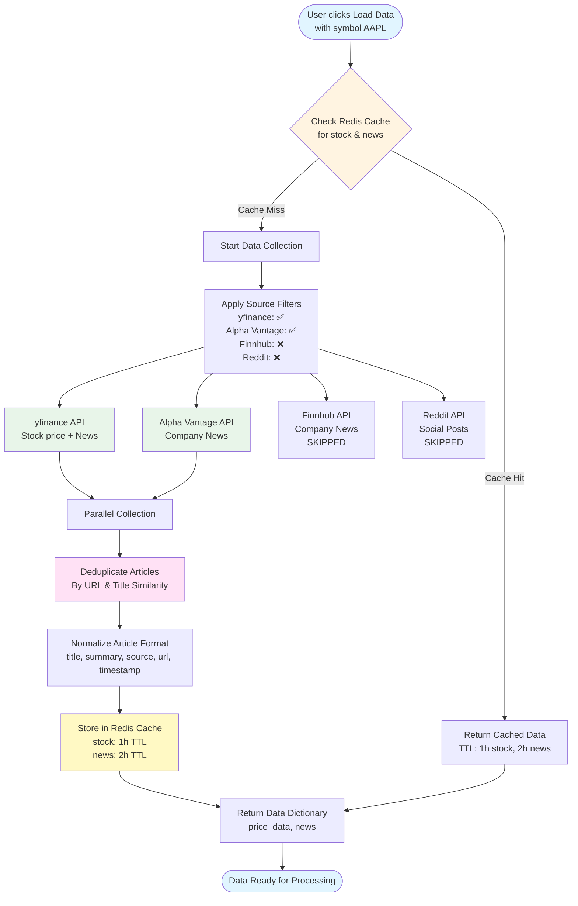

# Mermaid Diagrams Source Code

This file contains all Mermaid diagram source code extracted from INDEX_V3.md.
This is kept for reference and future modifications.

**Total Diagrams:** 29

---

## Diagram 1

**Location:** Line 176 in INDEX_V3.md

**Context:** ## High-Level Architecture ### Complete System Overview


---

## Diagram 2

**Location:** Line 264 in INDEX_V3.md

**Context:** ### System Architecture Overview


---

## Diagram 3

**Location:** Line 330 in INDEX_V3.md

**Context:** ### Component Interaction Flow


---

## Diagram 4

**Location:** Line 394 in INDEX_V3.md

**Context:** ### API-Driven Architecture Flow


---

## Diagram 5

**Location:** Line 437 in INDEX_V3.md

**Context:** ### Deployment Architecture


---

## Diagram 6

**Location:** Line 543 in INDEX_V3.md

**Context:** ### Component Relationship Diagram


---

## Diagram 7

**Location:** Line 2975 in INDEX_V3.md

**Context:** #### User Request Flow Diagram


---

## Diagram 8

**Location:** Line 3079 in INDEX_V3.md

**Context:** #### Data Collection Flow Diagram



---

## Diagram 9

**Location:** Line 3156 in INDEX_V3.md

**Context:** #### RAG Storage Flow Diagram


---

## Diagram 10

**Location:** Line 3251 in INDEX_V3.md

**Context:** #### Sentiment Analysis Flow Diagram


---

## Diagram 11

**Location:** Line 3302 in INDEX_V3.md

**Context:** Diagram 11


---

## Diagram 12

**Location:** Line 3375 in INDEX_V3.md

**Context:** #### RAG Retrieval Flow Diagram


---

## Diagram 13

**Location:** Line 3426 in INDEX_V3.md

**Context:** Diagram 13


---

## Diagram 14

**Location:** Line 3548 in INDEX_V3.md

**Context:** #### Cosine Similarity Visualization


---

## Diagram 15

**Location:** Line 3685 in INDEX_V3.md

**Context:** #### RRF Calculation Flow Diagram


---

## Diagram 16

**Location:** Line 3799 in INDEX_V3.md

**Context:** #### Temporal Decay Curve Visualization


---

## Diagram 17

**Location:** Line 3965 in INDEX_V3.md

**Context:** #### Normalization Process Diagram


---

## Diagram 18

**Location:** Line 4091 in INDEX_V3.md

**Context:** #### Batch Processing Flow Diagram


---

## Diagram 19

**Location:** Line 4194 in INDEX_V3.md

**Context:** #### HNSW Graph Structure Visualization


---

## Diagram 20

**Location:** Line 4256 in INDEX_V3.md

**Context:** Diagram 20


---

## Diagram 21

**Location:** Line 4313 in INDEX_V3.md

**Context:** ### 6.1.1 Data Source Integration Architecture

```mermaid
flowchart TB
    subgraph "User Request"
        USER[User Request<br/>Symbol: AAPL]
    end
    
    subgraph "Data Collector Service"
        COLLECTOR[StockDataCollector<br/>collect_all_data]
        FILTER[Source Filtering<br/>Apply user filters]
        DEDUPE[Deduplication<br/>Remove duplicates]
        NORMALIZE[Data Normalization<br/>Standard format]
    end
    
    subgraph "Data Sources"
        YFINANCE[yfinance API<br/>✅ Always Enabled<br/>Stock + News]
        ALPHA[Alpha Vantage API<br/>⚠️ Optional<br/>Requires API Key<br/>Company News]
        FINN[Finnhub API<br/>⚠️ Optional<br/>Requires API Key<br/>Financial News]
        REDDIT[Reddit API<br/>⚠️ Optional<br/>Requires Credentials<br/>Social Media]
    end
    
    subgraph "Cache Layer"
        REDIS_CACHE[Redis Cache<br/>Check before fetch<br/>Store after fetch]
    end
    
    subgraph "Output"
        RESULT[Combined Results<br/>price_data + news]
    end
    
    USER --> COLLECTOR
    COLLECTOR --> FILTER
    FILTER --> REDIS_CACHE
    
    REDIS_CACHE -->|Cache Miss| YFINANCE
    REDIS_CACHE -->|Cache Miss| ALPHA
    REDIS_CACHE -->|Cache Miss| FINN
    REDIS_CACHE -->|Cache Miss| REDDIT
    
    YFINANCE --> DEDUPE
    ALPHA --> DEDUPE
    FINN --> DEDUPE
    REDDIT --> DEDUPE
    
    DEDUPE --> NORMALIZE
    NORMALIZE --> REDIS_CACHE
    REDIS_CACHE -->|Cache Hit| RESULT
    NORMALIZE --> RESULT
    
    style USER fill:#e1f5ff
    style COLLECTOR fill:#fff4e1
    style YFINANCE fill:#e8f5e9
    style ALPHA fill:#fff9c4
    style FINN fill:#fff9c4
    style REDDIT fill:#fff9c4
    style REDIS_CACHE fill:#ffe1f5
    style RESULT fill:#e8f5e9
```

---

## Diagram 22

**Location:** Line 4532 in INDEX_V3.md

**Context:** Diagram 22

```mermaid
flowchart TD
    START([User Request with Sources]) --> PARSE[Parse Source Filters<br/>yfinance, alpha_vantage, etc.]
    
    PARSE --> CHECK{Source Enabled?}
    
    CHECK -->|yfinance| YFINANCE[yfinance Collection<br/>Always enabled]
    CHECK -->|alpha_vantage| ALPHA[Alpha Vantage Collection<br/>Requires API key]
    CHECK -->|finnhub| FINN[Finnhub Collection<br/>Requires API key]
    CHECK -->|reddit| REDDIT[Reddit Collection<br/>Requires credentials]
    
    YFINANCE --> COLLECT[Parallel Collection<br/>All enabled sources]
    ALPHA --> COLLECT
    FINN --> COLLECT
    REDDIT --> COLLECT
    
    COLLECT --> DEDUPE[Deduplicate Articles<br/>By URL & Title]
    
    DEDUPE --> NORMALIZE[Normalize Format<br/>Standard structure]
    
    NORMALIZE --> CACHE[Cache in Redis<br/>2h TTL]
    
    CACHE --> RETURN[Return Combined Results]
    
    style START fill:#e1f5ff
    style COLLECT fill:#fff9c4
    style RETURN fill:#e8f5e9
```

---

## Diagram 23

**Location:** Line 4579 in INDEX_V3.md

**Context:** ### 6.8 Data Normalization Flow

```mermaid
flowchart LR
    subgraph "Source-Specific Formats"
        YF_FORMAT[yfinance Format<br/>Nested structure<br/>content.title<br/>content.summary]
        AV_FORMAT[Alpha Vantage Format<br/>REST API JSON<br/>title, description<br/>published_time]
        FINN_FORMAT[Finnhub Format<br/>REST API JSON<br/>headline, summary<br/>datetime]
        REDDIT_FORMAT[Reddit Format<br/>PRAW Object<br/>title, selftext<br/>created_utc]
    end
    
    subgraph "Normalization Process"
        EXTRACT[Extract Fields<br/>title, summary, source, url, timestamp]
        CLEAN[Clean & Sanitize<br/>Remove HTML, normalize whitespace]
        VALIDATE[Validate & Default<br/>Ensure all fields present]
    end
    
    subgraph "Standard Format"
        STANDARD[Standard Article Format<br/>title: str<br/>summary: str<br/>source: str<br/>url: str<br/>timestamp: datetime]
    end
    
    YF_FORMAT --> EXTRACT
    AV_FORMAT --> EXTRACT
    FINN_FORMAT --> EXTRACT
    REDDIT_FORMAT --> EXTRACT
    
    EXTRACT --> CLEAN
    CLEAN --> VALIDATE
    VALIDATE --> STANDARD
    
    style YF_FORMAT fill:#e8f5e9
    style AV_FORMAT fill:#fff9c4
    style FINN_FORMAT fill:#fff9c4
    style REDDIT_FORMAT fill:#fff9c4
    style STANDARD fill:#ffe1f5
```

---

## Diagram 24

**Location:** Line 4645 in INDEX_V3.md

**Context:** ### 7.2 Cache Architecture

```mermaid
flowchart TB
    subgraph "Cache Types"
        STOCK_CACHE[Stock Data Cache<br/>Key: stock:AAPL<br/>TTL: 1 hour<br/>Data: price, market_cap, company_name]
        NEWS_CACHE[News Articles Cache<br/>Key: news:AAPL<br/>TTL: 2 hours<br/>Data: List of articles]
        SENTIMENT_CACHE[Sentiment Cache<br/>Key: sentiment:hash<br/>TTL: 24 hours<br/>Data: positive, negative, neutral]
        EMBEDDING_CACHE[Embedding Cache<br/>Key: embedding:hash<br/>TTL: 7 days<br/>Data: 1536-dim vector]
        DUPLICATE_MARKER[Duplicate Markers<br/>Key: article_hash:SYMBOL:ID<br/>TTL: 7 days<br/>Data: '1' marker]
    end
    
    subgraph "Cache Operations"
        GET[GET Operation<br/>Check if exists]
        SET[SET Operation<br/>Store with TTL]
        EXISTS[EXISTS Check<br/>Fast lookup]
    end
    
    subgraph "Cache Statistics"
        STATS[Cache Stats<br/>Hits, Misses, Sets<br/>Stored in Redis]
    end
    
    STOCK_CACHE --> GET
    NEWS_CACHE --> GET
    SENTIMENT_CACHE --> GET
    EMBEDDING_CACHE --> GET
    DUPLICATE_MARKER --> EXISTS
    
    GET -->|Cache Hit| STATS
    GET -->|Cache Miss| SET
    SET --> STATS
    
    style STOCK_CACHE fill:#e8f5e9
    style NEWS_CACHE fill:#e8f5e9
    style SENTIMENT_CACHE fill:#fff9c4
    style EMBEDDING_CACHE fill:#ffe1f5
    style STATS fill:#fff4e1
```

---

## Diagram 25

**Location:** Line 4753 in INDEX_V3.md

**Context:** ### 7.6 Cache Flow Diagram

```mermaid
flowchart TD
    START([Data Request]) --> CHECK{Check Redis Cache}
    
    CHECK -->|Cache Hit| RETURN[Return Cached Data<br/>Update Stats]
    CHECK -->|Cache Miss| FETCH[Fetch from API/Service]
    
    FETCH --> PROCESS[Process Data]
    PROCESS --> STORE[Store in Redis<br/>with TTL]
    
    STORE --> RETURN
    
    subgraph "Cache Statistics"
        STATS[Track Cache Stats<br/>Hits, Misses, Sets]
    end
    
    RETURN --> STATS
    
    style START fill:#e1f5ff
    style CHECK fill:#fff9c4
    style RETURN fill:#e8f5e9
    style STATS fill:#ffe1f5
```

---

## Diagram 26

**Location:** Line 4831 in INDEX_V3.md

**Context:** ### 8.2 Authentication ### 8.2.1 API Request/Response Flow

```mermaid
sequenceDiagram
    participant Client as API Client<br/>(Frontend/External)
    participant FastAPI as FastAPI Server<br/>(api/main.py)
    participant Middleware as Middleware<br/>(CORS, Logging)
    participant Route as API Route<br/>(routes/*.py)
    participant Validator as Request Validator<br/>(Pydantic Models)
    participant Deps as Dependencies<br/>(Service Injection)
    participant Service as Service Layer<br/>(Business Logic)
    participant External as External Services<br/>(APIs, Databases)
    
    Client->>FastAPI: HTTP Request<br/>GET /sentiment/AAPL?detailed=true
    FastAPI->>Middleware: Process Request<br/>(CORS, Logging)
    Middleware->>Route: Route to Handler
    Route->>Validator: Validate Parameters<br/>(Path, Query, Body)
    
    alt Validation Failed
        Validator-->>Client: 400 Bad Request<br/>Error Details
    else Validation Success
        Validator->>Deps: Get Services<br/>(Dependency Injection)
        Deps->>Service: Call Business Logic<br/>(orchestrator.get_aggregated_sentiment)
        
        Service->>External: Fetch Data<br/>(APIs, Cache, Vector DB)
        External-->>Service: Return Data
        
        Service->>Service: Process & Aggregate
        Service-->>Deps: Return Results
        Deps-->>Route: Return Data Dictionary
        
        Route->>Validator: Validate Response<br/>(Pydantic Models)
        Validator->>Middleware: JSON Response
        Middleware->>FastAPI: Add Headers
        FastAPI-->>Client: HTTP 200 OK<br/>JSON Response
    end
```

---

## Diagram 27

**Location:** Line 5172 in INDEX_V3.md

**Context:** ## Configuration Guide ### 9.1 Configuration Loading Flow

```mermaid
flowchart TD
    START([Application Start]) --> LOAD_ENV[Load .env File<br/>python-dotenv]
    
    LOAD_ENV --> PARSE[Parse Environment Variables<br/>Pydantic BaseSettings]
    
    PARSE --> VALIDATE[Validate Settings<br/>Type checking, format validation]
    
    VALIDATE --> CHECK_REQUIRED{Required<br/>Settings Present?}
    
    CHECK_REQUIRED -->|No| ERROR[Raise ValueError<br/>Show helpful error message]
    CHECK_REQUIRED -->|Yes| CREATE[Create Settings Instance<br/>Singleton Pattern]
    
    CREATE --> NESTED[Initialize Nested Settings<br/>AzureOpenAI, Redis, App, etc.]
    
    NESTED --> VALIDATE_NESTED[Validate Each Nested Setting<br/>URLs, ports, API keys]
    
    VALIDATE_NESTED --> CHECK_OPTIONAL{Optional<br/>Settings Valid?}
    
    CHECK_OPTIONAL -->|Invalid| WARN[Log Warning<br/>Use defaults or disable feature]
    CHECK_OPTIONAL -->|Valid| STORE[Store in Global Singleton<br/>_settings variable]
    
    WARN --> STORE
    STORE --> AVAILABLE[Settings Available<br/>get_settings returns instance]
    
    AVAILABLE --> SERVICES[Services Initialize<br/>Using settings]
    
    style START fill:#e1f5ff
    style VALIDATE fill:#fff9c4
    style ERROR fill:#ffe1f5
    style STORE fill:#e8f5e9
    style AVAILABLE fill:#e8f5e9
```

---

## Diagram 28

**Location:** Line 5208 in INDEX_V3.md

**Context:** Diagram 28

```mermaid
graph TD
    SETTINGS[Settings<br/>Main Container]
    
    SETTINGS --> AZURE_OPENAI[AzureOpenAISettings<br/>endpoint, api_key, deployment_name]
    SETTINGS --> REDIS[RedisSettings<br/>host, port, password, ssl]
    SETTINGS --> AZURE_SEARCH[AzureAISearchSettings<br/>endpoint, api_key, index_name<br/>Optional]
    SETTINGS --> DATA_SOURCES[DataSourceSettings<br/>alpha_vantage, finnhub, reddit<br/>Optional]
    SETTINGS --> APP[AppSettings<br/>cache_ttl, rag_top_k, etc.]
    
    style SETTINGS fill:#e1f5ff
    style AZURE_OPENAI fill:#fff9c4
    style REDIS fill:#fff9c4
    style APP fill:#e8f5e9
```

---

## Diagram 29

**Location:** Line 5466 in INDEX_V3.md

**Context:** ## Troubleshooting & FAQ ### 10.1 Troubleshooting Decision Tree

```mermaid
flowchart TD
    START([Application Issue]) --> CHECK_ERROR{What Error?}
    
    CHECK_ERROR -->|Redis Error| REDIS_ISSUE[Redis Connection Failed]
    CHECK_ERROR -->|OpenAI Error| OPENAI_ISSUE[Azure OpenAI Error]
    CHECK_ERROR -->|No Data| DATA_ISSUE[No Articles Found]
    CHECK_ERROR -->|RAG Error| RAG_ISSUE[RAG Not Finding Articles]
    CHECK_ERROR -->|Timeout| TIMEOUT_ISSUE[API Timeout]
    CHECK_ERROR -->|Other| OTHER_ISSUE[Check Logs]
    
    REDIS_ISSUE --> REDIS_CHECK[Check .env:<br/>REDIS_HOST, REDIS_PASSWORD]
    REDIS_CHECK --> REDIS_TEST[Test Connection:<br/>redis-cli ping]
    REDIS_TEST --> REDIS_FIX{Connection OK?}
    REDIS_FIX -->|No| REDIS_NETWORK[Check Network/Firewall]
    REDIS_FIX -->|Yes| REDIS_WORKING[✅ Working<br/>App continues without cache]
    
    OPENAI_ISSUE --> OPENAI_CHECK[Check .env:<br/>AZURE_OPENAI_API_KEY]
    OPENAI_CHECK --> OPENAI_VERIFY[Verify in Azure Portal:<br/>Deployment, Quota, Region]
    OPENAI_VERIFY --> OPENAI_FIX{Valid?}
    OPENAI_FIX -->|No| OPENAI_UPDATE[Update Configuration]
    OPENAI_FIX -->|Yes| OPENAI_FALLBACK[⚠️ Using TextBlob Fallback]
    
    DATA_ISSUE --> DATA_SYMBOL[Check Symbol Valid<br/>e.g., AAPL not APPL]
    DATA_SYMBOL --> DATA_SOURCES[Check Sources Enabled<br/>yfinance always works]
    DATA_SOURCES --> DATA_API[Check API Status<br/>yfinance may be down]
    DATA_API --> DATA_WORKING{Data Found?}
    DATA_WORKING -->|No| DATA_TRY[Try Different Symbol]
    DATA_WORKING -->|Yes| DATA_SUCCESS[✅ Working]
    
    RAG_ISSUE --> RAG_CONFIG[Check Azure AI Search Config<br/>Optional, has Redis fallback]
    RAG_CONFIG --> RAG_INDEX[Verify Index Exists<br/>Check Azure Portal]
    RAG_INDEX --> RAG_DELAY[Check Indexing Delay<br/>New articles need time]
    RAG_DELAY --> RAG_FILTERS[Check Filters<br/>May be too restrictive]
    RAG_FILTERS --> RAG_WORKING{Articles Found?}
    RAG_WORKING -->|No| RAG_FALLBACK[⚠️ Using Redis SCAN Fallback]
    RAG_WORKING -->|Yes| RAG_SUCCESS[✅ Working]
    
    TIMEOUT_ISSUE --> TIMEOUT_INCREASE[Increase Timeout<br/>APP_API_TIMEOUT=300]
    TIMEOUT_INCREASE --> TIMEOUT_SOURCES[Reduce Data Sources<br/>Fewer API calls]
    TIMEOUT_SOURCES --> TIMEOUT_CACHE[Enable Caching<br/>Faster responses]
    TIMEOUT_CACHE --> TIMEOUT_WORKING{Timeout Fixed?}
    TIMEOUT_WORKING -->|No| TIMEOUT_NETWORK[Check Network Speed]
    TIMEOUT_WORKING -->|Yes| TIMEOUT_SUCCESS[✅ Working]
    
    OTHER_ISSUE --> LOGS[Check Application Logs<br/>Detailed error messages]
    LOGS --> DOCS[Review Documentation<br/>This file]
    
    style START fill:#e1f5ff
    style REDIS_WORKING fill:#e8f5e9
    style OPENAI_FALLBACK fill:#fff9c4
    style DATA_SUCCESS fill:#e8f5e9
    style RAG_SUCCESS fill:#e8f5e9
    style TIMEOUT_SUCCESS fill:#e8f5e9
```

---

