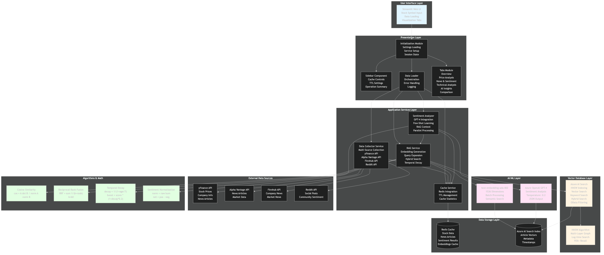
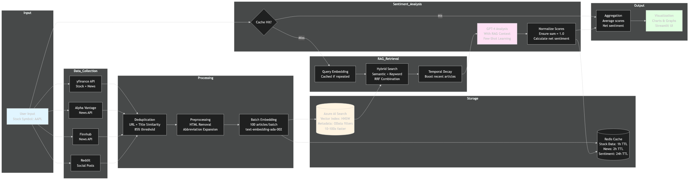
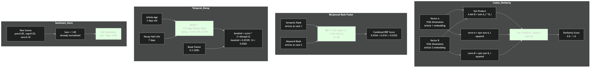
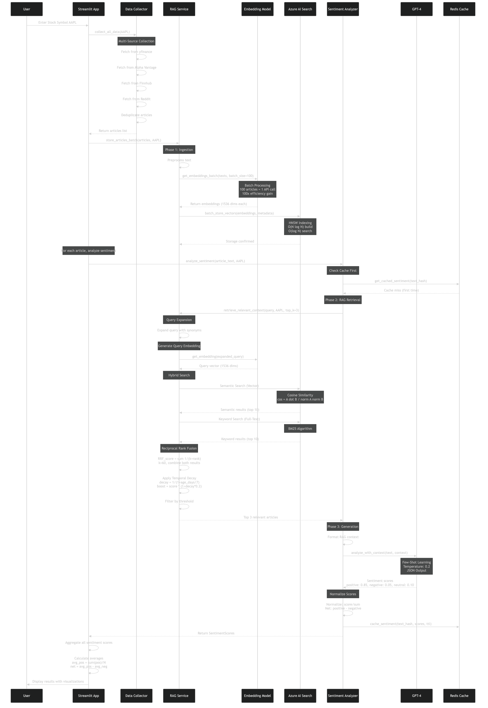
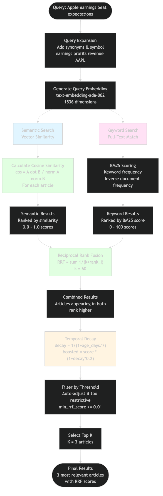
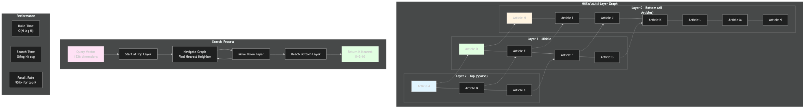
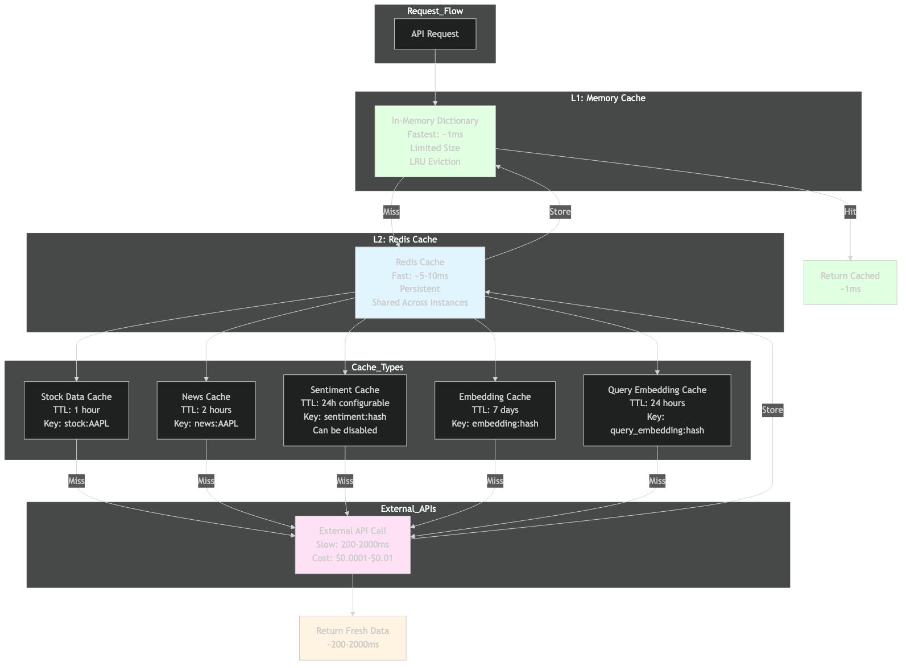

# Stock Sentiment Analysis Dashboard - Complete Documentation

**Version:** 1.0  
**Last Updated:** November 2025  
**Author:** Anand Mohan Singh  
**Repository:** [https://github.com/anandDev77/stock-sentiment-analysis](https://github.com/anandDev77/stock-sentiment-analysis)  
**Target Audience:** ML Engineers, Data Scientists, Software Developers, and ML Enthusiasts

---

## Table of Contents

1. [Introduction](#introduction)
2. [Prerequisites and Learning Path](#prerequisites-and-learning-path)
3. [What This Application Does](#what-this-application-does)
4. [High-Level Architecture](#high-level-architecture)
5. [Technology Stack](#technology-stack)
6. [Modular Application Structure](#modular-application-structure)
7. [Complete Example: End-to-End Walkthrough](#complete-example-end-to-end-walkthrough)
8. [How It Works: Layman's Explanation](#how-it-works-laymans-explanation)
9. [How It Works: Technical Deep Dive](#how-it-works-technical-deep-dive)
10. [How It All Fits Together](#how-it-all-fits-together)
11. [Core Components](#core-components)
12. [Data Flow and Processing Pipeline](#data-flow-and-processing-pipeline)
13. [Machine Learning Models and Techniques](#machine-learning-models-and-techniques)
14. [RAG (Retrieval Augmented Generation) System](#rag-retrieval-augmented-generation-system)
15. [Vector Database Architecture](#vector-database-architecture)
16. [Data Sources Integration](#data-sources-integration)
17. [Caching Strategy](#caching-strategy)
18. [Performance Optimizations](#performance-optimizations)
19. [Try It Yourself: Hands-On Tutorial](#try-it-yourself-hands-on-tutorial)
20. [Deployment and Scaling](#deployment-and-scaling)
21. [API Reference](#api-reference)
22. [Frequently Asked Questions (FAQ)](#frequently-asked-questions-faq)
23. [Troubleshooting](#troubleshooting)
24. [Contributing](#contributing)

---

## Introduction

The **Stock Sentiment Analysis Dashboard** is a production-grade web application that leverages cutting-edge AI and ML techniques to analyze financial news and provide sentiment insights for stock market analysis. Built with enterprise-level architecture patterns, it demonstrates best practices in ML engineering, including RAG (Retrieval Augmented Generation) with hybrid search, Azure AI Search for high-performance vector search, multi-source data collection, intelligent caching, parallel processing, and cost optimization.

### Key Highlights

- **AI-Powered Analysis**: Uses Azure OpenAI GPT-4 for sophisticated sentiment analysis
- **Context-Aware RAG**: Hybrid search (semantic + keyword) with Reciprocal Rank Fusion (RRF) for better accuracy
- **High-Performance Vector Search**: Azure AI Search provides 10-100× faster search than traditional methods
- **Multi-Source Data Collection**: Aggregates news from Yahoo Finance, Alpha Vantage, Finnhub, and Reddit
- **Modular Architecture**: Clean separation of concerns with presentation, service, and infrastructure layers
- **High Performance**: Multi-tier caching, batch processing, and parallel execution
- **Production-Ready**: Circuit breakers, retry logic, error handling, and comprehensive logging
- **Cost-Optimized**: Intelligent caching reduces API calls by 50-90%
- **Demo-Ready**: Operation summaries, detailed logging, and configurable cache controls

---

## Prerequisites and Learning Path

### For Complete Beginners

**Before reading this documentation, you should understand:**

1. **Basic Python** (variables, functions, lists, dictionaries)
   - If you're new to Python: [Python for Beginners](https://www.python.org/about/gettingstarted/)
   - Interactive tutorial: [Python.org Tutorial](https://docs.python.org/3/tutorial/)

2. **What is an API?** (how programs talk to each other)
   - Simple explanation: An API is like a menu in a restaurant - you order (request), the kitchen (server) prepares it, and you get your food (response)
   - Learn more: [What is an API?](https://www.ibm.com/topics/api)

3. **What is a database?** (storing and retrieving data)
   - Simple explanation: A database is like a filing cabinet - you store information (data) and can retrieve it later
   - Learn more: [Database Basics](https://www.oracle.com/database/what-is-database/)

### If You're New to Machine Learning

**Recommended reading before diving deep:**

1. **Machine Learning Basics** (2-3 hours)
   - [Machine Learning Crash Course](https://developers.google.com/machine-learning/crash-course) (Google) - Free, beginner-friendly
   - [Andrew Ng's Machine Learning Course](https://www.coursera.org/learn/machine-learning) - Week 1-2 only
   - Focus on: What is ML? Supervised vs unsupervised learning

2. **Natural Language Processing (NLP)** (1-2 hours)
   - [What is NLP?](https://www.ibm.com/topics/natural-language-processing) - IBM's beginner guide
   - [NLP Explained Simply](https://monkeylearn.com/blog/what-is-natural-language-processing/) - Visual explanations
   - Focus on: How computers understand text

3. **Neural Networks Basics** (1-2 hours)
   - [3Blue1Brown Neural Networks](https://www.youtube.com/playlist?list=PLZHQObOWTQDNU6R1_67000Dx_ZCJB-3pi) - Visual, intuitive explanations
   - Focus on: How neural networks learn patterns

4. **Vector Databases** (1 hour)
   - [What is a Vector Database?](https://www.pinecone.io/learn/vector-database/) - Pinecone's guide
   - [Vector Search Explained](https://www.elastic.co/what-is/vector-search) - Elastic's explanation
   - Focus on: How vector databases enable semantic search

### Recommended Reading Order for This Documentation

**For Complete Beginners:**
1. ✅ **Start Here**: [What This Application Does](#what-this-application-does) (non-technical overview)
2. ✅ **Then**: [Understanding Key Concepts First](#understanding-key-concepts-first) (foundations)
3. ✅ **Then**: [Complete Example: End-to-End Walkthrough](#complete-example-end-to-end-walkthrough) (see it in action!)
4. ✅ **Then**: [How It Works: Layman's Explanation](#how-it-works-laymans-explanation) (step-by-step process)
5. ✅ **Then**: [How It All Fits Together](#how-it-all-fits-together) (big picture)
6. ✅ **Finally**: Technical sections as needed (dive deeper when ready)

**For Experienced ML Practitioners:**
- Jump to [High-Level Architecture](#high-level-architecture) or [Technical Deep Dive](#how-it-works-technical-deep-dive)
- Review [Modular Application Structure](#modular-application-structure) for architecture details
- Use [API Reference](#api-reference) for implementation details

### Interactive Learning Tools

**Visualize Concepts:**
- [Embedding Projector](https://projector.tensorflow.org/) - Visualize how embeddings work (interactive!)
- [Transformer Playground](https://transformer.huggingface.co/) - See how transformers process text
- [Attention Visualization](https://github.com/jessevig/bertviz) - Understand attention mechanisms

**Practice:**
- [Hugging Face NLP Course](https://huggingface.co/learn/nlp-course/) - Hands-on NLP tutorials
- [Fast.ai Practical Deep Learning](https://www.fast.ai/) - Learn by building

---

## What This Application Does

### For Non-Technical Users

Imagine you're an investor trying to understand how the market feels about Apple's stock. You could:

1. **Manually read** hundreds of news articles from multiple sources (takes hours)
2. **Try to interpret** whether each article is positive or negative (subjective)
3. **Summarize** the overall sentiment (error-prone)
4. **Remember** relevant context from previous articles (impossible at scale)

This application does all of that **automatically in seconds**:

1. **Fetches** the latest news articles from multiple sources (Yahoo Finance, Alpha Vantage, Finnhub, Reddit)
2. **Stores** articles in a searchable knowledge base (Azure AI Search)
3. **Reads and understands** each article using AI
4. **Finds relevant context** from similar articles using hybrid search
5. **Determines sentiment** (positive, negative, or neutral) for each article with context
6. **Provides visualizations** showing overall sentiment trends
7. **Gives insights** based on historical context and patterns

Think of it as having a **team of financial analysts** working 24/7, reading every news article from multiple sources, remembering everything in a searchable database, and providing you with a comprehensive sentiment report that considers context from related articles.

### For Technical Users

This application demonstrates:

- **LLM Integration**: Using Azure OpenAI GPT-4 for natural language understanding
- **RAG Architecture**: Enhancing LLM responses with retrieved context from Azure AI Search
- **Hybrid Search**: Combining semantic (vector) and keyword search using Reciprocal Rank Fusion (RRF)
- **Vector Database**: Azure AI Search for 10-100× faster vector search at scale
- **Multi-Source Data Collection**: Aggregating news from 4 different APIs
- **Caching Strategies**: Multi-tier caching (session state, Redis, API calls) for performance
- **Parallel Processing**: Concurrent sentiment analysis for throughput
- **Modular Architecture**: Clean separation of concerns with presentation, service, and infrastructure layers
- **Cost Management**: Intelligent caching reduces API calls by 50-90%
- **Production Patterns**: Circuit breakers, retry logic, error handling, comprehensive logging

---

## High-Level Architecture

The application follows a **layered, modular architecture** with clear separation of concerns:

**Architecture Diagram**


### Architecture Layers Explained

1. **Presentation Layer**: Streamlit-based web dashboard with modular components
   - `app.py`: Thin orchestrator
   - `presentation/`: UI components, tabs, styling, initialization
   - User interactions and session state management

2. **Application Layer**: Business logic and orchestration
   - `presentation/data_loader.py`: Data loading pipeline
   - Coordinates between services

3. **Service Layer**: Core business logic
   - `services/collector.py`: Multi-source data collection
   - `services/sentiment.py`: AI sentiment analysis
   - `services/rag.py`: RAG with hybrid search
   - `services/cache.py`: Redis caching
   - `services/vector_db.py`: Azure AI Search integration

4. **Infrastructure Layer**: External services and data storage
   - Azure OpenAI (GPT-4, embeddings)
   - Azure AI Search (vector database)
   - Redis (caching)
   - External APIs (yfinance, Alpha Vantage, Finnhub, Reddit)

### Component Interaction Flow


### Complete System Architecture (Full Detail with Algorithms)

This comprehensive diagram shows the entire application architecture with all components, algorithms, and data flows labeled:



### Data Flow Diagram

This comprehensive data flow diagram shows how data moves through the entire system:



---

## Technology Stack

### Core Technologies

| Technology | Version | Purpose | Documentation |
|------------|---------|---------|--------------|
| **Python** | 3.8+ | Programming language | [Python Docs](https://docs.python.org/3/) |
| **Streamlit** | Latest | Web framework for dashboard | [Streamlit Docs](https://docs.streamlit.io/) |
| **Azure OpenAI** | GPT-4 | Large Language Model for sentiment analysis | [Azure OpenAI Docs](https://learn.microsoft.com/en-us/azure/ai-services/openai/) |
| **Azure AI Search** | Latest | Vector database and search service | [Azure AI Search Docs](https://learn.microsoft.com/en-us/azure/search/) |
| **Redis** | 7.0+ | In-memory cache | [Redis Docs](https://redis.io/docs/) |
| **yfinance** | Latest | Stock market data API (primary source) | [yfinance Docs](https://github.com/ranaroussi/yfinance) |

### ML/AI Libraries

| Library | Purpose | Link |
|---------|---------|------|
| **openai** | Azure OpenAI SDK | [OpenAI Python SDK](https://github.com/openai/openai-python) |
| **numpy** | Numerical computations (cosine similarity, vector operations) | [NumPy Docs](https://numpy.org/doc/) |
| **azure-search-documents** | Azure AI Search SDK | [Azure Search SDK](https://learn.microsoft.com/en-us/python/api/azure-search-documents/) |

### Data Sources

| Source | Purpose | API/Library | Rate Limits |
|--------|---------|-------------|-------------|
| **yfinance** | Primary source - Stock prices, company info, news | yfinance library | None (public API) |
| **Alpha Vantage** | Company news | REST API | 500 calls/day (free tier) |
| **Finnhub** | Company news | REST API | 60 calls/minute (free tier) |
| **Reddit** | Social media sentiment | PRAW library | 60 requests/minute |

### Data Processing

| Library | Purpose | Link |
|---------|---------|------|
| **pandas** | Data manipulation | [Pandas Docs](https://pandas.pydata.org/) |
| **plotly** | Interactive visualizations | [Plotly Docs](https://plotly.com/python/) |
| **dateutil** | Date parsing and manipulation | [dateutil Docs](https://dateutil.readthedocs.io/) |

### Infrastructure

| Service | Purpose | Link |
|---------|---------|------|
| **Azure OpenAI** | LLM and embeddings | [Azure OpenAI](https://azure.microsoft.com/en-us/products/ai-services/openai-service) |
| **Azure AI Search** | Vector database and search | [Azure AI Search](https://azure.microsoft.com/en-us/products/ai-services/ai-search) |
| **Azure Cache for Redis** | Caching | [Azure Redis](https://azure.microsoft.com/en-us/products/cache) |

### Development Tools

| Tool | Purpose | Link |
|------|---------|------|
| **Pydantic** | Settings management and validation | [Pydantic Docs](https://docs.pydantic.dev/) |
| **pytest** | Testing framework | [pytest Docs](https://docs.pytest.org/) |
| **black** | Code formatting | [Black Docs](https://black.readthedocs.io/) |

---

## Modular Application Structure

### Overview

The application follows a modular, layered architecture with clear separation of concerns. The main application file (`app.py`) is a thin orchestrator (~150 lines) that coordinates between presentation layer components, services, and infrastructure. This architecture improves maintainability, testability, and scalability.

### Directory Structure

```
src/stock_sentiment/
├── app.py                          # Thin orchestrator (entry point, ~150 lines)
├── presentation/                   # Presentation Layer
│   ├── styles.py                  # Custom CSS styling
│   ├── initialization.py          # App setup, service initialization
│   ├── data_loader.py             # Data loading orchestration
│   ├── components/                # Reusable UI components
│   │   ├── sidebar.py             # Sidebar with filters, settings, operation summary
│   │   └── empty_state.py         # Empty state component
│   └── tabs/                      # Tab modules
│       ├── __init__.py            # Tab exports
│       ├── overview_tab.py        # Overview dashboard
│       ├── price_analysis_tab.py  # Price charts and analysis
│       ├── news_sentiment_tab.py  # News and sentiment display
│       ├── technical_analysis_tab.py  # Technical indicators
│       ├── ai_insights_tab.py     # AI-generated insights
│       └── comparison_tab.py     # Multi-stock comparison
├── services/                      # Service Layer (Business Logic)
│   ├── collector.py               # Multi-source data collection
│   ├── sentiment.py               # AI sentiment analysis
│   ├── rag.py                     # RAG service with hybrid search
│   ├── cache.py                   # Redis caching
│   └── vector_db.py               # Azure AI Search integration
├── config/                        # Configuration
│   └── settings.py                # Pydantic settings management
├── models/                        # Data Models
│   ├── sentiment.py               # SentimentScores model
│   └── stock.py                   # StockData model
└── utils/                         # Utilities
    ├── logger.py                  # Logging configuration
    ├── retry.py                   # Retry logic with exponential backoff
    ├── circuit_breaker.py         # Circuit breaker pattern
    └── preprocessing.py           # Text preprocessing
```

### Presentation Layer Components

#### 1. Main Application (`app.py`)

**Purpose**: Thin orchestrator that coordinates the application flow.

**Responsibilities**:
- Imports and initializes presentation layer modules
- Coordinates between different components
- Manages tab rendering

**Key Flow**:
```python
1. Setup application (styles, initialization)
2. Initialize settings and services
3. Render sidebar (filters, settings, operation summary)
4. Load data if requested
5. Render tabs based on data availability
```

**Size**: ~150 lines (down from 2135 lines)

#### 2. Initialization Module (`presentation/initialization.py`)

**Purpose**: Centralized initialization of all application components.

**Key Functions**:
- `initialize_settings()`: Load and validate application settings
- `initialize_services()`: Create service instances (Redis, RAG, Collector, Analyzer)
- `initialize_session_state()`: Initialize Streamlit session state
- `setup_app()`: Configure Streamlit page settings

**Service Initialization**:
- Uses `@st.cache_resource` for singleton services
- Handles graceful degradation if services unavailable
- Provides fallback mechanisms

#### 3. Data Loader (`presentation/data_loader.py`)

**Purpose**: Orchestrates the complete data loading and processing pipeline.

**Key Functions**:
- `load_stock_data()`: Main orchestration function

**Process Flow**:
1. **Step 1**: Fetch stock data (with Redis cache check)
2. **Step 2**: Collect news from multiple sources (with source filters)
3. **Step 3**: Store articles in RAG (Azure AI Search)
4. **Step 4**: Analyze sentiment for all articles (with RAG context)
5. **Step 5**: Store results in session state

**Features**:
- Progress tracking with progress bars
- Comprehensive logging for demos
- Operation summary tracking (Redis usage, RAG usage, cache hits/misses)
- Error handling with user-friendly messages

#### 4. Sidebar Component (`presentation/components/sidebar.py`)

**Purpose**: Provides user controls and system information.

**Sections**:
- **System Status**: Redis and RAG service availability
- **Search Filters**: 
  - Stock symbol input
  - Data source toggles (yfinance, Alpha Vantage, Finnhub, Reddit)
  - RAG filter controls (exclude sources)
- **Sentiment Cache Controls**:
  - Enable/disable sentiment caching
  - TTL slider (0.1 to 168 hours)
  - Allows testing RAG by disabling cache
- **Operation Summary**: 
  - Redis usage (stock/news/sentiment cache hits)
  - RAG usage (queries made, articles found)
  - Articles stored in RAG
  - Summary of last operation

#### 5. Tab Modules (`presentation/tabs/`)

Each tab is a self-contained module with a `render_*_tab()` function:

- **Overview Tab**: Dashboard with key metrics, sentiment distribution
- **Price Analysis Tab**: Stock price charts, historical data
- **News & Sentiment Tab**: Article list with sentiment scores
- **Technical Analysis Tab**: Technical indicators, moving averages
- **AI Insights Tab**: AI-generated insights and recommendations
- **Comparison Tab**: Multi-stock comparison functionality

### Benefits of Modular Architecture

1. **Maintainability**: Each module has a single responsibility
2. **Testability**: Components can be tested in isolation
3. **Scalability**: Easy to add new tabs or components
4. **Readability**: Smaller files are easier to understand
5. **Collaboration**: Multiple developers can work on different modules
6. **Reusability**: Components can be reused across the application

---

## Complete Example: End-to-End Walkthrough

This section shows a **complete, real example** of analyzing a stock from start to finish. Follow along to see how everything works together with the modular architecture, Azure AI Search, and multi-source data collection!

### Scenario: Analyzing Apple (AAPL) Stock

**User Input:**
- Stock Symbol: `AAPL`
- Data Sources Enabled: yfinance, Alpha Vantage, Finnhub (Reddit disabled)
- Action: Click "Load Data" button

---

### Step 1: Data Collection 📊

**What Happens:**
1. System checks Redis cache: "Do we have AAPL data cached?"
2. Cache miss (first time) → Fetch from multiple enabled sources
3. Data collected in parallel from:
   - **yfinance** (primary, always enabled): Stock prices, company info, news
   - **Alpha Vantage** (enabled): Company news
   - **Finnhub** (enabled): Company news
4. Articles deduplicated across sources (by title and URL)
5. Retrieved data:

**Stock Price Data:**
```json
{
  "symbol": "AAPL",
  "price": 272.75,
  "company_name": "Apple Inc.",
  "market_cap": 4030250000000,
  "timestamp": "2024-12-13T10:30:00"
}
```

**News Articles Retrieved (20 articles from multiple sources):**
```json
[
  {
    "title": "Apple reports record Q4 earnings, stock surges 5%",
    "summary": "Apple Inc. reported record-breaking fourth quarter earnings, beating analyst expectations. The stock surged 5% in after-hours trading.",
    "url": "https://example.com/apple-earnings",
    "source": "Yahoo Finance",
    "timestamp": "2024-12-13T09:00:00"
  },
  {
    "title": "Apple's iPhone sales exceed expectations",
    "summary": "Strong iPhone sales drove Apple's quarterly results, with revenue up 8% year-over-year.",
    "url": "https://example.com/iphone-sales",
    "source": "Finnhub",
    "timestamp": "2024-12-13T08:30:00"
  },
  {
    "title": "AAPL: Strong quarterly performance",
    "summary": "Apple demonstrates robust financial health with strong quarterly metrics...",
    "url": "https://example.com/alpha-vantage-news",
    "source": "Alpha Vantage",
    "timestamp": "2024-12-13T08:00:00"
  }
  // ... 17 more articles from various sources
]
```

**Source Breakdown:**
- Yahoo Finance: 10 articles
- Finnhub: 6 articles
- Alpha Vantage: 4 articles

**Result:** Data cached in Redis for 1 hour (stock) and 2 hours (news)

---

### Step 2: Article Processing & Storage 💾

**Example: Processing All 20 Articles**

**a) Text Preprocessing (Batch):**
```
Input:  "Apple reports record Q4 earnings, stock surges 5%"
Output: "Apple reports record fourth quarter earnings, stock surges 5%"
```
- Expanded: `Q4` → `fourth quarter`
- Removed: HTML tags (if any)
- Normalized: Whitespace
- Applied to all 20 articles

**b) Embedding Generation (Batch Processing):**
```
Input Texts: 20 articles prepared for batch embedding
Batch Size: 100 (all articles processed in one API call to Azure OpenAI)

Embeddings Generated (1536 dimensions each):
Article 1: [0.123, -0.456, 0.789, 0.234, -0.567, ..., 0.345]
Article 2: [0.234, -0.345, 0.678, 0.345, -0.456, ..., 0.456]
...
Article 20: [0.345, -0.234, 0.567, 0.456, -0.345, ..., 0.567]
(Truncated for display - each embedding has 1536 dimensions)
```

**Visual Representation:**
Think of embeddings as coordinates on a map:
- Location: (0.123, -0.456) in the "Apple/Finance/Earnings" region
- Similar articles will have similar coordinates (close on the map)
- Azure AI Search uses HNSW algorithm to find nearest neighbors quickly

**c) Storage in Azure AI Search:**
```
All 20 articles stored in Azure AI Search index 'stock-articles'

Each article stored with:
- Vector embedding (contentVector field) - for semantic search
- Text content (content field: title + summary) - for keyword search
- Metadata:
  - symbol: "AAPL"
  - title: Article title
  - summary: Article summary
  - source: "Yahoo Finance", "Finnhub", or "Alpha Vantage"
  - url: Article URL
  - timestamp: Publication date
  - article_id: Unique article identifier

Article ID format: AAPL:abc123def456
```

**Also marked in Redis for duplicate checking:**
- Key: `article_hash:AAPL:abc123def456`
- TTL: 7 days

**Result:** All 20 articles processed and stored in Azure AI Search (batch processing makes this fast - 1 API call instead of 20!)

---

### Step 3: Sentiment Analysis (First Article) 🤖

**Article to Analyze:**
- Text: "Apple reports record Q4 earnings, stock surges 5%"

**a) Cache Check:**
```
Check: sentiment:hash("Apple reports record Q4 earnings, stock surges 5%")
Result: Cache miss (first time analyzing this article)
Action: Proceed to RAG retrieval
```

**b) RAG Context Retrieval (Hybrid Search):**

**Query:** "Apple reports record Q4 earnings, stock surges 5%"

**Step 3b.1: Generate Query Embedding**
```
Query embedding: [0.125, -0.458, 0.791, 0.236, -0.569, ..., 0.347]
(Similar to article embedding - they're about the same topic!)
Cached in Redis for 24 hours
```

**Step 3b.2: Semantic Search (Azure AI Search)**
```
Using Azure AI Search for vector search:
- Query vector: [0.125, -0.458, 0.791, ...]
- Filter: symbol eq 'AAPL'
- Search method: HNSW approximate nearest neighbor
- Found 50 articles in database (from previous searches)

Top 3 Similar Articles (by cosine similarity):
1. "Apple's quarterly profits surge" 
   - Similarity: 0.92 (very similar!)
   - Article ID: AAPL:xyz789
   - Source: Yahoo Finance
   
2. "Apple beats earnings expectations"
   - Similarity: 0.88 (very similar!)
   - Article ID: AAPL:def456
   - Source: Finnhub
   
3. "Apple stock rises on strong earnings"
   - Similarity: 0.85 (very similar!)
   - Article ID: AAPL:ghi789
   - Source: Alpha Vantage
```

**Step 3b.3: Keyword Search (Azure AI Search)**
```
Using Azure AI Search for full-text search:
- Query: "Apple reports record Q4 earnings stock surges"
- Search field: content (title + summary)
- Filter: symbol eq 'AAPL'
- Search method: BM25 ranking algorithm

Top 3 Keyword Matches:
1. "Apple earnings report Q4" 
   - Keyword score: 8.5 (6 keyword matches)
   - Article ID: AAPL:jkl012
   - Source: Yahoo Finance
   
2. "Apple Q4 earnings call" 
   - Keyword score: 6.2 (4 matches)
   - Article ID: AAPL:mno345
   - Source: Finnhub
   
3. "Apple quarterly earnings" 
   - Keyword score: 4.8 (3 matches)
   - Article ID: AAPL:pqr678
   - Source: Alpha Vantage
```

**Step 3b.4: Hybrid Search (RRF Combination)**
```
Combined results using Reciprocal Rank Fusion (RRF):

RRF Formula: RRF_score = Σ(1 / (60 + rank)) for each search result

Final Top 3 Articles for Context:
1. "Apple's quarterly profits surge" (RRF score: 0.0328)
   - Ranked #1 in semantic (score: 1/(60+1) = 0.0164)
   - Ranked #3 in keyword (score: 1/(60+3) = 0.0159)
   - Combined: 0.0164 + 0.0159 = 0.0323
   
2. "Apple beats earnings expectations" (RRF score: 0.0315)
   - Ranked #2 in semantic (score: 1/(60+2) = 0.0161)
   - Ranked #2 in keyword (score: 1/(60+2) = 0.0161)
   - Combined: 0.0161 + 0.0161 = 0.0322
   
3. "Apple stock rises on strong earnings" (RRF score: 0.0297)
   - Ranked #3 in semantic (score: 1/(60+3) = 0.0159)
   - Ranked #1 in keyword (score: 1/(60+1) = 0.0164)
   - Combined: 0.0159 + 0.0164 = 0.0323
```

**Step 3b.5: Temporal Decay Applied**
```
All articles are recent (same day), so no decay applied.
If articles were older, recent ones would be boosted by up to 20%.

Temporal decay formula: decay = 1.0 / (1 + age_days / 7)
Boost: boosted_score = current_score * (1 + decay * 0.2)
```

**Context Retrieved:**
```markdown
### Relevant Context from Recent News:

**Article 1: "Apple's quarterly profits surge"**
- Source: Yahoo Finance
- Summary: Apple's quarterly profits exceeded expectations...
- Relevance: 92% similar (semantic), RRF score: 0.0328

**Article 2: "Apple beats earnings expectations"**
- Source: Finnhub
- Summary: Apple Inc. reported earnings that beat analyst estimates...
- Relevance: 88% similar (semantic), RRF score: 0.0315

**Article 3: "Apple stock rises on strong earnings"**
- Source: Alpha Vantage
- Summary: Apple stock gained following strong quarterly earnings report...
- Relevance: 85% similar (semantic), RRF score: 0.0297
```

**c) LLM Analysis:**

**Prompt Sent to GPT-4:**
```markdown
System: You are a professional financial sentiment analyzer.

Examples:
Text: "Apple reports record-breaking Q4 earnings, stock surges 5%"
Analysis: {"positive": 0.85, "negative": 0.05, "neutral": 0.10}

User: Analyze the sentiment of: "Apple reports record Q4 earnings, stock surges 5%"

Relevant Context:
- Article 1: "Apple's quarterly profits surge" (92% similar, Yahoo Finance)
- Article 2: "Apple beats earnings expectations" (88% similar, Finnhub)
- Article 3: "Apple stock rises on strong earnings" (85% similar, Alpha Vantage)
```

**GPT-4 Response:**
```json
{
  "positive": 0.85,
  "negative": 0.05,
  "neutral": 0.10
}
```

**Interpretation:**
- **85% Positive**: Strong indicators (record earnings, stock surge)
- **5% Negative**: Minimal negative sentiment
- **10% Neutral**: Some neutral information

**Why RAG Helped:**
- Without RAG: Might have been less confident (70-75% positive)
- With RAG: More confident (85% positive) because context from multiple sources shows this is consistently positive news

**d) Caching (if enabled):**
```
Stored in Redis (if sentiment caching enabled):
Key: sentiment:hash("Apple reports record Q4 earnings, stock surges 5%")
Value: {"positive": 0.85, "negative": 0.05, "neutral": 0.10}
TTL: 24 hours (configurable via UI)
```

---

### Step 4: Repeat for All Articles

**All 20 Articles Analyzed (in parallel, 5 at a time):**
```
Article 1: {"positive": 0.85, "negative": 0.05, "neutral": 0.10}
Article 2: {"positive": 0.80, "negative": 0.10, "neutral": 0.10}
Article 3: {"positive": 0.75, "negative": 0.15, "neutral": 0.10}
...
Article 20: {"positive": 0.40, "negative": 0.50, "neutral": 0.10}
```

**Note:** Articles analyzed in parallel (5 at a time) for speed! Each analysis uses RAG context from Azure AI Search.

---

### Step 5: Aggregation 📈

**Calculate Averages:**
```
Average Positive: (0.85 + 0.80 + 0.75 + ... + 0.40) / 20 = 0.625 (62.5%)
Average Negative: (0.05 + 0.10 + 0.15 + ... + 0.50) / 20 = 0.275 (27.5%)
Average Neutral: (0.10 + 0.10 + 0.10 + ... + 0.10) / 20 = 0.10 (10.0%)
```

**Net Sentiment:**
```
Net Sentiment = Average Positive - Average Negative
              = 0.625 - 0.275
              = +0.35 (35% bullish)
```

**Interpretation:**
- **Overall Sentiment**: Bullish (positive)
- **Confidence**: Moderate to high (62.5% positive)
- **Market Outlook**: Generally positive for AAPL

---

### Step 6: Visualization 📊

**Results Displayed in Dashboard:**

**Overview Tab:**
- Overall Sentiment: 62.5% Positive, 27.5% Negative, 10% Neutral
- Net Sentiment: +35% (Bullish)
- Charts: Pie chart, bar chart, trend line
- Source breakdown: Yahoo Finance (10), Finnhub (6), Alpha Vantage (4)

**News & Sentiment Tab:**
- List of all 20 articles from multiple sources
- Each article shows:
  - Title and summary
  - Sentiment scores (color-coded)
  - Source (Yahoo Finance, Alpha Vantage, Finnhub) and timestamp
  - Link to full article
- Source filter visualization

**AI Insights Tab:**
- AI-generated summary: "Apple shows strong positive sentiment with 62.5% positive articles. Key themes: record earnings, strong iPhone sales, stock price gains. Overall outlook: Bullish."

**Operation Summary (in Sidebar):**
- Redis used: ✅ (stock cached, news cached, sentiment: 14 hits, 6 misses)
- RAG used: ✅ (6 queries made, 18 articles found)
- Articles stored in RAG: 20

---

### Summary: What Just Happened?

1. ✅ **Fetched** stock data and 20 news articles from 3 sources (yfinance, Alpha Vantage, Finnhub)
2. ✅ **Processed** articles (cleaned, embedded in batch, stored in Azure AI Search)
3. ✅ **Retrieved** relevant context using hybrid search (semantic + keyword with RRF)
4. ✅ **Analyzed** sentiment for each article (with RAG context from Azure AI Search)
5. ✅ **Aggregated** results into overall sentiment
6. ✅ **Visualized** everything in an easy-to-understand dashboard

**Total Time:** ~5-10 seconds (thanks to caching, batch processing, and parallel execution!)

**Cost:** ~$0.02 (API calls for embeddings and sentiment analysis)

**Performance:**
- Azure AI Search: 10-100× faster than Redis SCAN for vector search
- Batch embedding: 1 API call instead of 20 (20× reduction)
- Parallel sentiment analysis: 5 articles at a time

**Next Time:** Even faster! (cached data = instant, cached sentiment = instant)

---

## Complete Example: End-to-End Walkthrough

Let's walk through a complete example of analyzing Apple (AAPL) stock sentiment from start to finish.

### Step 1: User Input

You open the application and enter "AAPL" in the stock symbol input field, then click "Load Data".

### Step 2: Data Collection (Multi-Source V2)

The application collects data from multiple sources:

**Stock Price Data (yfinance):**
```python
{
    "symbol": "AAPL",
    "price": 175.43,
    "company_name": "Apple Inc.",
    "market_cap": 2750000000000,
    "timestamp": "2024-11-18T10:30:00"
}
```

**News Articles (Multi-Source):**

**From yfinance:**
- Article 1: "Apple reports Q4 earnings beat expectations"
- Article 2: "Apple unveils new MacBook Pro lineup"

**From Alpha Vantage (if enabled):**
- Article 3: "Apple stock rises on strong iPhone sales"

**From Finnhub (if enabled):**
- Article 4: "Analysts upgrade Apple to 'Buy'"

**From Reddit (if enabled):**
- Post 1: "AAPL earnings call discussion - r/stocks"

Total: 5 articles collected

### Step 3: Article Storage with Azure AI Search

Each article is processed and stored in Azure AI Search:

**Article 1 Processing:**

1. **Text Preprocessing:**
```python
original = "Apple reports Q4 earnings beat expectations"
cleaned = "Apple reports fourth quarter earnings beat expectations"
```

2. **Embedding Generation (Batch):**
```python
# All 5 articles processed in ONE API call (batch)
embeddings = get_embeddings_batch([article1, article2, article3, article4, article5])
# Result: 5 embeddings (1536 dimensions each) in ~1 second
```

3. **Storage in Azure AI Search:**
```python
{
    "id": "aapl_article_12345",
    "content": "Apple reports fourth quarter earnings beat expectations",
    "contentVector": [0.123, -0.456, 0.789, ..., 0.234],  # 1536 numbers
    "symbol": "AAPL",
    "title": "Apple reports Q4 earnings beat expectations",
    "summary": "Apple exceeded analyst expectations...",
    "source": "yfinance",
    "url": "https://finance.yahoo.com/...",
    "timestamp": "2024-11-18T08:00:00",
    "article_id": "aapl_article_12345"
}
```

**Why Azure AI Search?**
- Native vector indexing (HNSW algorithm)
- 10-100x faster than Redis SCAN for large datasets
- Built-in hybrid search (semantic + keyword)
- OData filtering (date ranges, sources, symbols)

### Step 4: Sentiment Analysis with RAG

For each article, the system performs RAG-enhanced sentiment analysis:

**Analyzing Article 1: "Apple reports Q4 earnings beat expectations"**

**4a. Cache Check:**
```python
cache_key = "sentiment:md5_hash_of_text"
cached_result = redis.get(cache_key)
# Result: None (first time analyzing this article)
```

**4b. RAG Context Retrieval (Hybrid Search):**

**Query Expansion:**
```python
original_query = "Apple reports Q4 earnings beat expectations"
expanded_query = "Apple reports Q4 earnings beat expectations financial results profit revenue"
```

**Embedding Generation:**
```python
query_embedding = get_embedding(expanded_query)
# Cached if query was used before
```

**Semantic Search (Azure AI Search):**
```python
# Vector search using cosine similarity
semantic_results = azure_search.vector_search(
    query_vector=query_embedding,
    top_k=10,
    filter="symbol eq 'AAPL'"
)

Results:
1. "Apple quarterly profits surge" (similarity: 0.92)
2. "Apple Q3 earnings exceed forecasts" (similarity: 0.88)
3. "Apple revenue growth continues" (similarity: 0.85)
```

**Keyword Search (Azure AI Search):**
```python
# Full-text search on content
keyword_results = azure_search.text_search(
    search_text="Apple earnings beat expectations",
    top_k=10,
    filter="symbol eq 'AAPL'"
)

Results:
1. "Apple earnings report Q4" (score: 8.5)
2. "Apple beats analyst expectations" (score: 7.8)
3. "Apple Q4 financial results" (score: 6.9)
```

**Reciprocal Rank Fusion (RRF) - Combining Results:**

**Mathematical Formula:**
```
RRF_score(d) = Σ(1 / (k + rank_i(d)))
where k = 60 (RRF constant)
```

**Calculation for "Apple quarterly profits surge":**
```python
# Appears at rank 1 in semantic search
semantic_score = 1 / (60 + 1) = 0.0164

# Appears at rank 5 in keyword search
keyword_score = 1 / (60 + 5) = 0.0154

# Combined RRF score
rrf_score = 0.0164 + 0.0154 = 0.0318
```

**Temporal Decay - Boosting Recent Articles:**

**Mathematical Formula:**
```
decay = 1.0 / (1 + age_days / decay_days)
boosted_score = rrf_score * (1 + decay * 0.2)

where decay_days = 7 (configurable)
```

**Calculation:**
```python
article_date = "2024-11-15"  # 3 days ago
age_days = 3
decay_days = 7

decay = 1.0 / (1 + 3/7) = 1.0 / 1.428 = 0.70
boost = decay * 0.2 = 0.14 (14% boost)
boosted_score = 0.0318 * (1 + 0.14) = 0.0362
```

**Final Top 3 Articles for Context:**
```python
[
    {
        "title": "Apple quarterly profits surge",
        "summary": "Apple reported strong Q3 results...",
        "similarity": 0.92,
        "rrf_score": 0.0362,
        "source": "yfinance",
        "timestamp": "2024-11-15"
    },
    {
        "title": "Apple beats analyst expectations",
        "summary": "Wall Street reacts positively...",
        "similarity": 0.85,
        "rrf_score": 0.0340,
        "source": "Alpha Vantage",
        "timestamp": "2024-11-16"
    },
    {
        "title": "Apple earnings call highlights",
        "summary": "CEO discusses future outlook...",
        "similarity": 0.83,
        "rrf_score": 0.0315,
        "source": "Finnhub",
        "timestamp": "2024-11-14"
    }
]
```

**4c. LLM Analysis (GPT-4 with RAG Context):**

**Prompt Construction:**
```python
system_prompt = """
You are a professional financial sentiment analyzer.

## Examples (Few-Shot Learning):
Text: "Apple reports record-breaking Q4 earnings, stock surges 5%"
Analysis: {"positive": 0.85, "negative": 0.05, "neutral": 0.10}

Text: "Company faces regulatory investigation, shares drop 3%"
Analysis: {"positive": 0.10, "negative": 0.75, "neutral": 0.15}

Analyze the sentiment following these examples.
Respond ONLY with valid JSON.
"""

user_prompt = f"""
Analyze the sentiment of the following text about AAPL.

**Text to Analyze:**
Apple reports Q4 earnings beat expectations

**Relevant Context from Recent News:**

### Article 1: Apple quarterly profits surge
**Source:** yfinance
**Summary:** Apple reported strong Q3 results with revenue up 12%
**Relevance:** 92%

### Article 2: Apple beats analyst expectations
**Source:** Alpha Vantage
**Summary:** Wall Street reacts positively to earnings
**Relevance:** 85%

### Article 3: Apple earnings call highlights
**Source:** Finnhub
**Summary:** CEO discusses future outlook, investors optimistic
**Relevance:** 83%

Provide sentiment scores (positive, negative, neutral) as JSON.
"""
```

**API Call to Azure OpenAI GPT-4:**
```python
response = openai.chat.completions.create(
    model="gpt-4",
    temperature=0.2,  # Low for consistency
    max_tokens=200,
    response_format={"type": "json_object"},
    messages=[
        {"role": "system", "content": system_prompt},
        {"role": "user", "content": user_prompt}
    ]
)
```

**GPT-4 Response:**
```json
{
    "positive": 0.85,
    "negative": 0.05,
    "neutral": 0.10,
    "reasoning": "Strong positive indicators: 'beat expectations' suggests outperformance. Context shows consistent positive earnings pattern."
}
```

**Score Normalization:**

**Mathematical Formula:**
```
normalized_score = raw_score / sum(all_scores)
net_sentiment = positive - negative
```

**Calculation:**
```python
raw_scores = {"positive": 0.85, "negative": 0.05, "neutral": 0.10}
sum_scores = 0.85 + 0.05 + 0.10 = 1.00  # Already normalized!

# If not normalized (e.g., sum = 1.05):
# positive = 0.85 / 1.05 = 0.810
# negative = 0.05 / 1.05 = 0.048
# neutral = 0.10 / 1.05 = 0.095

net_sentiment = 0.85 - 0.05 = 0.80 (strongly positive)
```

**4d. Cache Result:**
```python
redis.set(
    key="sentiment:md5_hash_of_text",
    value={"positive": 0.85, "negative": 0.05, "neutral": 0.10},
    ttl=86400  # 24 hours (configurable)
)
```

### Step 5: Parallel Processing

All 5 articles are analyzed in parallel using ThreadPoolExecutor:

```python
# Sequential: 5 articles × 2 seconds = 10 seconds
# Parallel (5 workers): 5 articles / 5 = 2 seconds

with ThreadPoolExecutor(max_workers=5) as executor:
    futures = [executor.submit(analyze_sentiment, article) for article in articles]
    results = [future.result() for future in futures]

# Result: All 5 articles analyzed in ~2 seconds
```

**Results:**
```python
[
    {"positive": 0.85, "negative": 0.05, "neutral": 0.10},  # Article 1
    {"positive": 0.75, "negative": 0.10, "neutral": 0.15},  # Article 2
    {"positive": 0.80, "negative": 0.08, "neutral": 0.12},  # Article 3
    {"positive": 0.70, "negative": 0.15, "neutral": 0.15},  # Article 4
    {"positive": 0.65, "negative": 0.20, "neutral": 0.15},  # Article 5
]
```

### Step 6: Aggregation

**Mathematical Formulas:**
```
avg_positive = Σ(positive_i) / N
avg_negative = Σ(negative_i) / N
avg_neutral = Σ(neutral_i) / N
net_sentiment = avg_positive - avg_negative
```

**Calculation:**
```python
avg_positive = (0.85 + 0.75 + 0.80 + 0.70 + 0.65) / 5 = 0.75  # 75%
avg_negative = (0.05 + 0.10 + 0.08 + 0.15 + 0.20) / 5 = 0.116  # 11.6%
avg_neutral = (0.10 + 0.15 + 0.12 + 0.15 + 0.15) / 5 = 0.134  # 13.4%

net_sentiment = 0.75 - 0.116 = 0.634  # Very positive!
```

### Step 7: Visualization

Results displayed in Streamlit dashboard:

**Key Metrics:**
- **Net Sentiment:** +63.4% (Bullish)
- **Overall Positive:** 75%
- **Overall Negative:** 11.6%
- **Articles Analyzed:** 5
- **Cache Hits:** 0 (first run)
- **RAG Used:** 5 times

**Charts:**
- Pie chart: Sentiment distribution
- Bar chart: Sentiment by source
- Timeline: Sentiment trend over time
- News feed: Individual articles with sentiment badges

### Performance Summary

**First Run (No Cache):**
- Data collection: 2 seconds
- Article storage (batch embeddings): 1 second
- Sentiment analysis (parallel): 2 seconds
- **Total: ~5 seconds**

**Second Run (With Cache):**
- Data collection: 0.1 seconds (Redis cache hit)
- Article storage: Skipped (already stored)
- Sentiment analysis: 0.1 seconds (Redis cache hit)
- **Total: ~0.2 seconds (25x faster!)**

**Cost Analysis:**
- **API Calls (First Run):**
  - Embeddings: 1 call (batch of 5)
  - Sentiment: 5 calls (one per article)
  - **Total: 6 calls, ~$0.02**

- **API Calls (Second Run):**
  - Embeddings: 0 (cached)
  - Sentiment: 0 (cached)
  - **Total: 0 calls, $0.00 (100% savings!)**

---

## How It Works: Layman's Explanation

### Understanding Key Concepts First

Before diving into how the application works, let's understand some fundamental concepts:

#### What is Sentiment Analysis?
**In Simple Terms:** Sentiment analysis is like teaching a computer to read text and figure out if the writer feels positive, negative, or neutral about a topic.

**Example:**
- "Apple's stock is soaring!" → **Positive** sentiment
- "Apple faces major lawsuit" → **Negative** sentiment  
- "Apple released quarterly report" → **Neutral** sentiment

**Why It Matters:** For investors, understanding market sentiment helps predict stock price movements. If news is mostly positive, the stock might go up. If negative, it might go down.

**Learn More:** [Sentiment Analysis Explained](https://www.ibm.com/topics/sentiment-analysis)

#### What is Machine Learning (ML)?
**In Simple Terms:** Machine learning is teaching computers to learn from examples, just like humans learn from experience.

**Example:** 
- Show a computer 1000 positive news articles and 1000 negative ones
- The computer learns patterns (positive words, negative words, context)
- When you give it a new article, it can predict the sentiment

**In This App:** We use a pre-trained AI model (GPT-4) that already understands language, so we don't need to train it from scratch.

**Learn More:** [Machine Learning Basics](https://www.coursera.org/learn/machine-learning)

#### What are Embeddings?
**In Simple Terms:** Embeddings convert text into numbers (vectors) that capture meaning. Think of it like translating words into a language computers understand.

**Analogy:** 
- Imagine each word/article as a point on a map
- Similar articles are close together on the map
- "Apple earnings" and "Apple profits" would be neighbors
- "Apple earnings" and "Weather forecast" would be far apart

**Why We Use Them:** 
- Computers can't read text directly
- Numbers allow mathematical operations (finding similar articles)
- Similar articles have similar number patterns

**Learn More:** [Word Embeddings Explained](https://www.tensorflow.org/text/guide/word_embeddings)

#### What is RAG (Retrieval Augmented Generation)?
**In Simple Terms:** RAG is like giving an AI assistant a library of reference books. When you ask a question, it:
1. Searches the library for relevant information
2. Reads those relevant pages
3. Uses that information to give you a better answer

**In This App:**
- The "library" is our collection of past news articles stored in Azure AI Search
- When analyzing sentiment, the AI first finds similar past articles using hybrid search
- It uses those articles as context to make better predictions

**Why It's Better:** Without RAG, the AI only uses its training data (which might be outdated). With RAG, it uses recent, relevant information.

**Learn More:** [RAG Explained Simply](https://www.pinecone.io/learn/retrieval-augmented-generation/)

#### What is Hybrid Search?
**In Simple Terms:** Hybrid search combines two search methods:
1. **Semantic search:** Finds articles by meaning (uses embeddings)
2. **Keyword search:** Finds articles by exact words (uses text matching)

**Example:**
- Query: "Apple earnings"
- Semantic search finds: "Apple quarterly profits" (same meaning, different words)
- Keyword search finds: "Apple earnings report" (exact keyword match)
- Hybrid search finds: **Both!** (20-30% better than either alone)

**Why It's Better:** Catches more relevant articles than using just one method.

#### What is Azure AI Search?
**In Simple Terms:** Azure AI Search is like a supercharged search engine for our article library.

**Features:**
- **Vector indexing:** Organizes embeddings for lightning-fast similarity search
- **Hybrid search:** Built-in semantic + keyword search
- **Filtering:** Find articles by date, source, or stock symbol
- **Speed:** 10-100x faster than basic database searches

**Why We Use It:** Makes RAG searches fast and accurate, even with thousands of articles.

#### What is Caching?
**In Simple Terms:** Caching is like keeping frequently used items close at hand instead of fetching them from far away every time.

**Real-World Analogy:**
- Without cache: Every time you want coffee, you drive to the store (slow, expensive)
- With cache: You keep coffee at home (fast, free)

**In This App:**
- First time analyzing an article: Call AI API (takes 2 seconds, costs money)
- Second time: Use cached result (takes 0.001 seconds, free)

**Learn More:** [Caching Explained](https://aws.amazon.com/caching/)

### Visualizing Embeddings: The Map Analogy

Think of embeddings like **GPS coordinates on a map**:

**Imagine a 2D map of all articles:**

```
                    [Weather Region]
                          |
                          |
    [Tech Region] ---- [Finance Region] ---- [Sports Region]
         |                    |
         |              [Apple/Finance]
         |                    |
    [Microsoft]          [Earnings Articles]
```

**Concrete Example:**

**Article 1**: "Apple reports record earnings"
- Embedding: `[0.5, 0.3, 0.8, ...]` (1536 numbers)
- **Location on map**: (0.5, 0.3) - in the "Apple/Finance/Earnings" region
- **Visual**: Point A on the map

**Article 2**: "Apple's quarterly profits surge"
- Embedding: `[0.52, 0.31, 0.79, ...]` (very similar numbers!)
- **Location on map**: (0.52, 0.31) - very close to Article 1!
- **Visual**: Point B, right next to Point A

**Article 3**: "Weather forecast sunny"
- Embedding: `[0.1, 0.9, 0.2, ...]` (different numbers)
- **Location on map**: (0.1, 0.9) - far away in "Weather" region
- **Visual**: Point C, far from Points A and B

**Distance = Similarity:**
- Articles 1 and 2 are **neighbors** (close on map) = **high similarity** (0.92)
- Articles 1 and 3 are **far apart** (different regions) = **low similarity** (0.15)

**Why This Works:**
- The embedding model (text-embedding-ada-002) was trained on billions of texts
- It learned that "earnings" and "profits" are similar concepts
- Articles about similar topics end up in similar "regions" of the embedding space
- We can find similar articles by measuring "distance" (cosine similarity)

**Try It Yourself:**
- Visit [Embedding Projector](https://projector.tensorflow.org/) to visualize embeddings interactively!
- Upload some text and see how similar texts cluster together

**Learn More:** 
- [Text Embeddings](https://platform.openai.com/docs/guides/embeddings)
- [Understanding Embeddings Visually](https://www.pinecone.io/learn/embeddings/)
- [Embedding Projector Tool](https://projector.tensorflow.org/) (Interactive visualization)

---

## Machine Learning Models and Algorithms

### 1. Large Language Model (LLM): GPT-4

**What is GPT-4?**
GPT-4 (Generative Pre-trained Transformer 4) is a state-of-the-art language model developed by OpenAI. It's capable of understanding and generating human-like text.

**In Simple Terms:**
- GPT-4 is an AI that has "read" most of the internet
- It understands language patterns, context, and meaning
- It can answer questions, write text, and analyze sentiment
- It's like having a very knowledgeable assistant that never forgets

**What is a Transformer?**
**In Simple Terms:** A transformer is a type of neural network architecture that's particularly good at understanding language.

**Key Concepts:**
- **Attention Mechanism**: The model "pays attention" to different parts of the text when making predictions
  - Example: When analyzing "Apple stock rises after earnings", it focuses on "rises" and "earnings"
- **Pre-training**: The model was trained on billions of texts before we use it
- **Fine-tuning**: We can customize it for specific tasks (like sentiment analysis)

**Why GPT-4 for Sentiment Analysis?**
- **Context Understanding**: Understands financial terminology and market context
  - Knows that "bullish" means positive, "bearish" means negative
  - Understands that "beats expectations" is positive even if word "beats" sounds negative
- **Nuanced Analysis**: Can detect subtle sentiment (not just positive/negative)
  - Can distinguish between "slightly positive" and "very positive"
- **Few-Shot Learning**: Learns from examples in the prompt (no retraining needed)
- **Structured Output**: Can return JSON-formatted results (easy to parse)

**How We Use It:**
- **Model**: Azure OpenAI GPT-4 (gpt-4 or gpt-4-turbo)
- **Temperature**: 0.2 (low for consistent results)
  - Temperature controls randomness: 0 = deterministic, 1 = creative
  - Low temperature = same input → same output (good for sentiment analysis)
- **Max Tokens**: 200 (sufficient for sentiment scores)
  - Tokens are pieces of text (roughly 1 token = 4 characters)
- **Response Format**: JSON object (structured output)
  - Ensures consistent format: `{"positive": 0.85, "negative": 0.05, "neutral": 0.10}`

**Learn More:**
- [GPT-4 Technical Report](https://arxiv.org/abs/2303.08774)
- [Azure OpenAI Documentation](https://learn.microsoft.com/en-us/azure/ai-services/openai/)
- [Transformer Architecture Explained](https://jalammar.github.io/illustrated-transformer/)
- [Attention Mechanism Explained](https://lilianweng.github.io/posts/2018-06-24-attention/)

### 2. Text Embeddings: text-embedding-ada-002

**What are Embeddings?**
Embeddings are numerical representations of text that capture semantic meaning. Similar texts have similar embeddings.

**Mathematical Representation:**

An embedding is a function that maps text to a dense vector in high-dimensional space:

```
E: Text → ℝ^d

where d = 1536 (dimensions for text-embedding-ada-002)
```

**Example:**
```python
text = "Apple reports record earnings"
embedding = E(text) = [0.123, -0.456, 0.789, ..., 0.234]  # 1536 numbers
```

**How Embeddings are Generated:**

1. **Tokenization**: Text is split into tokens
```
"Apple reports earnings" → ["Apple", "reports", "earnings"]
```

2. **Token Encoding**: Each token is converted to a number
```
["Apple", "reports", "earnings"] → [12345, 23456, 34567]
```

3. **Neural Network Processing**: The encoder processes tokens through multiple layers
```
Input tokens → Transformer layers → Output embedding vector
```

4. **Output**: A 1536-dimensional vector
```
embedding = [e1, e2, e3, ..., e1536]
```

**Why 1536 Dimensions?**
- More dimensions = more nuance and detail
- 1536 is optimal for balancing:
  - **Expressiveness**: Captures subtle semantic differences
  - **Efficiency**: Not too large (computational cost)
  - **Storage**: Reasonable memory footprint

**Learn More:**
- [OpenAI Embeddings Guide](https://platform.openai.com/docs/guides/embeddings)
- [Understanding Embeddings](https://www.pinecone.io/learn/embeddings/)

### 3. Cosine Similarity Algorithm

**Purpose**: Measure semantic similarity between two embedding vectors.

**Mathematical Formula:**

```
cos(θ) = (A · B) / (||A|| × ||B||)
```

**Where:**
- `A · B` = dot product of vectors A and B
- `||A||` = Euclidean norm (magnitude) of vector A
- `||B||` = Euclidean norm (magnitude) of vector B
- `θ` = angle between vectors

**Step-by-Step Calculation:**

**Step 1: Calculate Dot Product**
```
A · B = Σ(A_i × B_i) for i = 1 to 1536

Example:
A = [0.5, 0.3, 0.8]
B = [0.52, 0.31, 0.79]
A · B = (0.5 × 0.52) + (0.3 × 0.31) + (0.8 × 0.79)
      = 0.26 + 0.093 + 0.632
      = 0.985
```

**Step 2: Calculate Euclidean Norms**
```
||A|| = √(Σ(A_i²)) for i = 1 to 1536

Example:
A = [0.5, 0.3, 0.8]
||A|| = √(0.5² + 0.3² + 0.8²)
      = √(0.25 + 0.09 + 0.64)
      = √0.98
      = 0.99

Similarly:
||B|| = √(0.52² + 0.31² + 0.79²)
      = √(0.2704 + 0.0961 + 0.6241)
      = √0.9906
      = 0.995
```

**Step 3: Calculate Cosine Similarity**
```
cos(θ) = A · B / (||A|| × ||B||)
       = 0.985 / (0.99 × 0.995)
       = 0.985 / 0.985
       = 0.998 ≈ 1.0 (very similar!)
```

**Range**: 0.0 (orthogonal, no similarity) to 1.0 (identical, perfect similarity)

**Implementation in Python:**
```python
import numpy as np

def cosine_similarity(vec1, vec2):
    """
    Calculate cosine similarity between two vectors.
    
    Args:
        vec1: First embedding vector (list or numpy array)
        vec2: Second embedding vector (list or numpy array)
        
    Returns:
        Cosine similarity score (0.0 to 1.0)
    """
    vec1 = np.array(vec1)
    vec2 = np.array(vec2)
    
    # Calculate dot product
    dot_product = np.dot(vec1, vec2)
    
    # Calculate norms
    norm1 = np.linalg.norm(vec1)
    norm2 = np.linalg.norm(vec2)
    
    # Avoid division by zero
    if norm1 == 0 or norm2 == 0:
        return 0.0
    
    # Calculate cosine similarity
    return dot_product / (norm1 * norm2)
```

**Visual Explanation:**

Think of cosine similarity as measuring the **angle** between two arrows (vectors):

```
Small angle (similar):
    ↗ B (50°)
   /
  / 5° angle
 → A (45°)
Cosine similarity: cos(5°) ≈ 0.996

Large angle (different):
→ A (0°)          ↑ B (90°)
   90° angle
Cosine similarity: cos(90°) = 0.0
```

**Use Case**: Semantic search in RAG (finding similar articles)

**Complexity**: O(d) where d = vector dimension (1536)

**Mathematical Algorithms Visualization:**



### 4. Reciprocal Rank Fusion (RRF) Algorithm

**Purpose**: Combine multiple ranked lists without score normalization.

**Problem It Solves:**

When combining search results from different methods (semantic vs. keyword), scores are on different scales:
- Semantic search: scores 0.0-1.0 (cosine similarity)
- Keyword search: scores 0-100 (TF-IDF or BM25)

Simple averaging would give wrong weights!

**Solution: Use Ranks, Not Scores**

RRF uses the **position** (rank) of results, not raw scores.

**Mathematical Formula:**

```
RRF_score(d) = Σ(1 / (k + rank_i(d)))

where:
- d = document/article
- k = RRF constant (typically 60)
- rank_i(d) = rank of document d in search result i
- Sum is over all search results containing document d
```

**Why k=60?**
- Research shows k=60 provides good balance
- Higher k = flatter scores (ranks matter less)
- Lower k = steeper scores (ranks matter more)

**Step-by-Step Example:**

**Semantic Search Results:**
1. Article A: "Apple quarterly results" (rank 1, similarity: 0.92)
2. Article B: "Apple profit announcement" (rank 2, similarity: 0.88)
3. Article C: "Apple revenue growth" (rank 3, similarity: 0.85)

**Keyword Search Results:**
1. Article D: "Apple earnings report Q4" (rank 1, score: 95)
2. Article A: "Apple quarterly results" (rank 2, score: 88)  ← Same article!
3. Article E: "Apple earnings call" (rank 3, score: 82)

**RRF Calculation:**

**Article A** (appears in both searches):
```
Semantic rank = 1: RRF_score_semantic = 1 / (60 + 1) = 0.0164
Keyword rank = 2:  RRF_score_keyword = 1 / (60 + 2) = 0.0161

Combined RRF score = 0.0164 + 0.0161 = 0.0325
```

**Article B** (only in semantic search):
```
Semantic rank = 2: RRF_score_semantic = 1 / (60 + 2) = 0.0161

Combined RRF score = 0.0161
```

**Article D** (only in keyword search):
```
Keyword rank = 1: RRF_score_keyword = 1 / (60 + 1) = 0.0164

Combined RRF score = 0.0164
```

**Final Ranking:**
1. Article A: 0.0325 (highest - appears in both!)
2. Article D: 0.0164
3. Article B: 0.0161
4. Article C: 1/(60+3) = 0.0159
5. Article E: 1/(60+3) = 0.0159

**Result:** Article A ranks highest because it appears high in **both** searches!

**Implementation in Python:**
```python
def reciprocal_rank_fusion(semantic_results, keyword_results, k=60):
    """
    Combine multiple ranked lists using Reciprocal Rank Fusion.
    
    Args:
        semantic_results: List of articles from semantic search
        keyword_results: List of articles from keyword search
        k: RRF constant (default: 60)
        
    Returns:
        List of (article_id, rrf_score) tuples, sorted by score
    """
    rrf_scores = {}
    
    # Add semantic search results
    for rank, article in enumerate(semantic_results, start=1):
        article_id = article.get('article_id', '')
        if article_id:
            rrf_score = 1.0 / (k + rank)
            rrf_scores[article_id] = rrf_scores.get(article_id, 0.0) + rrf_score
    
    # Add keyword search results
    for rank, article in enumerate(keyword_results, start=1):
        article_id = article.get('article_id', '')
        if article_id:
            rrf_score = 1.0 / (k + rank)
            rrf_scores[article_id] = rrf_scores.get(article_id, 0.0) + rrf_score
    
    # Sort by RRF score (descending)
    sorted_results = sorted(rrf_scores.items(), key=lambda x: x[1], reverse=True)
    
    return sorted_results
```

**Use Case**: Hybrid search in RAG (combining semantic and keyword results)

**Complexity**: O(n) where n = total number of unique articles

**Learn More:**
- [Reciprocal Rank Fusion Paper](https://plg.uwaterloo.ca/~gvcormac/cormacksigir09-rrf.pdf)
- [Elasticsearch RRF](https://www.elastic.co/guide/en/elasticsearch/reference/current/rrf.html)

### 5. Temporal Decay Algorithm

**Purpose**: Boost recent articles in search results (financial news is time-sensitive).

**Problem**: All articles are equally weighted by similarity, but recent news is more relevant for current sentiment.

**Solution**: Apply a time-based boost that decays with age.

**Mathematical Formula:**

```
decay = 1.0 / (1 + age_days / decay_days)
boosted_score = current_score × (1 + decay × boost_factor)

where:
- age_days = days since article publication
- decay_days = decay half-life (default: 7 days)
- boost_factor = maximum boost multiplier (default: 0.2 = 20%)
```

**Step-by-Step Calculation:**

**Article Published Today (age = 0):**
```
decay = 1.0 / (1 + 0/7) = 1.0 / 1 = 1.0
boost = decay × 0.2 = 1.0 × 0.2 = 0.2 (20% boost)
boosted_score = 0.0318 × (1 + 0.2) = 0.0318 × 1.2 = 0.0382
```

**Article Published 7 Days Ago (age = 7):**
```
decay = 1.0 / (1 + 7/7) = 1.0 / 2 = 0.5 (half-life)
boost = decay × 0.2 = 0.5 × 0.2 = 0.1 (10% boost)
boosted_score = 0.0318 × (1 + 0.1) = 0.0318 × 1.1 = 0.0350
```

**Article Published 30 Days Ago (age = 30):**
```
decay = 1.0 / (1 + 30/7) = 1.0 / 5.29 ≈ 0.189
boost = decay × 0.2 = 0.189 × 0.2 ≈ 0.038 (3.8% boost)
boosted_score = 0.0318 × (1 + 0.038) = 0.0318 × 1.038 ≈ 0.0330
```

**Decay Curve:**

```
Boost
1.0 |•
    |  ••
0.5 |     ••• (half-life at 7 days)
    |         ••••••
0.0 |________________••••••••••••••••••••
    0     7      14      21      28   Days
```

**Implementation in Python:**
```python
def apply_temporal_decay(results, decay_days=7, boost_factor=0.2):
    """
    Apply temporal decay to boost recent articles.
    
    Args:
        results: List of article result dictionaries
        decay_days: Decay half-life in days (default: 7)
        boost_factor: Maximum boost multiplier (default: 0.2)
        
    Returns:
        Re-ranked results with temporal boost applied
    """
    from datetime import datetime
    
    now = datetime.now()
    
    for result in results:
        timestamp = result.get('timestamp', '')
        if not timestamp:
            continue
        
        # Parse timestamp
        try:
            if isinstance(timestamp, str):
                from dateutil import parser
                article_time = parser.parse(timestamp)
            else:
                article_time = timestamp
        except Exception:
            continue
        
        # Calculate age in days
        age_days = (now - article_time.replace(tzinfo=None)).days
        
        # Calculate decay
        decay = max(0.1, 1.0 / (1 + age_days / decay_days))
        
        # Get current score
        current_score = result.get('rrf_score', result.get('similarity', 0))
        
        # Apply boost
        boosted_score = current_score * (1 + decay * boost_factor)
        
        # Update score
        result['rrf_score'] = boosted_score
        result['temporal_boost'] = decay
    
    # Re-sort by boosted score
    return sorted(results, key=lambda x: x.get('rrf_score', 0), reverse=True)
```

**Use Case**: RAG retrieval (boosting recent articles)

**Configurable**: `decay_days` can be adjusted via `APP_RAG_TEMPORAL_DECAY_DAYS`

**Trade-off**: 
- Lower `decay_days` = steeper decay (recent articles much more important)
- Higher `decay_days` = gentler decay (older articles remain relevant longer)

### 6. Batch Embedding Generation Algorithm

**Purpose**: Reduce API calls by processing multiple texts in one request.

**Problem**: 
- Generating embeddings one-by-one: 100 articles = 100 API calls = expensive & slow
- Each API call has latency (~200ms) and cost (~$0.0001 per call)

**Solution**: Batch multiple texts into a single API request.

**Efficiency Gain:**

```
One-by-one: N articles = N API calls
Batch: N articles = ⌈N / batch_size⌉ API calls

Improvement: batch_size× reduction in API calls
```

**Examples:**
```
100 articles, batch_size=100: 100 calls → 1 call (100× improvement!)
100 articles, batch_size=50:  100 calls → 2 calls (50× improvement)
100 articles, batch_size=10:  100 calls → 10 calls (10× improvement)
```

**Cost Savings:**
```
100 articles × $0.0001 = $0.01 (one-by-one)
1 batch × $0.0001 = $0.0001 (batch)
Savings: 99% reduction in API overhead!
```

**Implementation in Python:**
```python
def get_embeddings_batch(texts, batch_size=100):
    """
    Generate embeddings for multiple texts in batches.
    
    Args:
        texts: List of text strings
        batch_size: Number of texts per batch (default: 100, max: 2048)
        
    Returns:
        List of embedding vectors (same length as texts)
    """
    from openai import AzureOpenAI
    
    client = AzureOpenAI(...)
    all_embeddings = []
    
    # Process in batches
    for i in range(0, len(texts), batch_size):
        batch = texts[i:i+batch_size]
        
        # Single API call for entire batch
        response = client.embeddings.create(
            model="text-embedding-ada-002",
            input=batch  # List of texts
        )
        
        # Extract embeddings in order
        batch_embeddings = [item.embedding for item in response.data]
        all_embeddings.extend(batch_embeddings)
    
    return all_embeddings
```

**Use Case**: RAG article storage (efficient embedding generation)

**Constraints**: 
- Azure OpenAI max batch size: 2048 texts
- Recommended batch size: 100-200 (balance between efficiency and memory)

**Complexity**: O(⌈N / batch_size⌉) API calls

---

## RAG (Retrieval Augmented Generation) System V2

### What is RAG?

**RAG** (Retrieval Augmented Generation) is a technique that enhances LLM responses by providing relevant context from a knowledge base.

**Traditional LLM:**
- Only uses information in its training data
- May hallucinate or provide outdated information
- No access to recent or domain-specific data

**RAG-Enhanced LLM:**
- Retrieves relevant context from external sources (Azure AI Search)
- Provides up-to-date information
- Reduces hallucinations by grounding in retrieved context

### RAG Architecture V2 (with Azure AI Search)

**Detailed RAG Flow with Algorithms**

This sequence diagram shows the complete RAG flow from data collection to sentiment analysis, including all algorithms and API calls:



**Hybrid Search Algorithm Flow**

This flowchart shows how hybrid search combines semantic and keyword search using RRF:



### RAG Implementation Details V2

#### Phase 1: Ingestion (Article Storage with Azure AI Search)

**Step 1: Text Preprocessing**
```python
def preprocess_text(text):
    """
    Clean and normalize text for better embedding quality.
    """
    # Remove HTML tags
    text = re.sub(r'<[^>]+>', '', text)
    
    # Normalize whitespace
    text = ' '.join(text.split())
    
    # Expand abbreviations (financial context)
    abbreviations = {
        'Q1': 'first quarter', 'Q2': 'second quarter',
        'Q3': 'third quarter', 'Q4': 'fourth quarter',
        'YoY': 'year over year', 'MoM': 'month over month',
        'EPS': 'earnings per share', 'P/E': 'price to earnings'
    }
    
    for abbr, full in abbreviations.items():
        text = text.replace(abbr, full)
    
    return text
```

**Step 2: Batch Embedding Generation**
```python
# Process 5 articles in ONE API call
articles = [article1, article2, article3, article4, article5]
texts = [preprocess_text(f"{a['title']} {a['summary']}") for a in articles]

# Batch embedding generation
embeddings = rag_service.get_embeddings_batch(texts, batch_size=5)
# Result: 5 embeddings in ~1 second (vs. 5 seconds one-by-one)
```

**Step 3: Storage in Azure AI Search**
```python
def store_in_azure_ai_search(article, embedding, symbol):
    """
    Store article with embedding in Azure AI Search index.
    """
    document = {
        "id": generate_unique_id(article),
        "content": f"{article['title']} {article['summary']}",
        "contentVector": embedding,  # 1536-dimensional vector
        "symbol": symbol,
        "title": article['title'],
        "summary": article['summary'],
        "source": article['source'],
        "url": article['url'],
        "timestamp": article['timestamp'].isoformat(),
        "article_id": article['article_id']
    }
    
    # Upload to Azure AI Search
    search_client.upload_documents([document])
    
    # Index is built automatically (HNSW algorithm)
```

**Why Azure AI Search?**
- **Native vector indexing**: HNSW (Hierarchical Navigable Small World) algorithm
- **Fast retrieval**: 10-100x faster than Redis SCAN
- **Hybrid search**: Built-in semantic + keyword search
- **Filtering**: OData filters (date ranges, sources, symbols)
- **Scalability**: Handles millions of documents efficiently

#### Phase 2: Retrieval (Hybrid Search with Azure AI Search)

**Step 1: Query Preprocessing & Expansion**
```python
def expand_query(query, symbol):
    """
    Expand query with synonyms and related terms for better retrieval.
    """
    # Financial synonyms
    synonyms = {
        'earnings': ['profits', 'revenue', 'results', 'financial'],
        'beat': ['exceed', 'surpass', 'outperform'],
        'loss': ['decline', 'drop', 'decrease', 'fall']
    }
    
    expanded = query
    for word, syns in synonyms.items():
        if word in query.lower():
            expanded += ' ' + ' '.join(syns)
    
    # Add symbol
    expanded += f' {symbol}'
    
    return expanded

# Example:
query = "Apple reports earnings beat expectations"
expanded = expand_query(query, "AAPL")
# Result: "Apple reports earnings beat expectations profits revenue results financial exceed surpass outperform AAPL"
```

**Step 2: Generate Query Embedding**
```python
query_embedding = rag_service.get_embedding(expanded_query)
# Cached if query was used before
```

**Step 3: Hybrid Search in Azure AI Search**

**A) Semantic Search (Vector Search):**
```python
def semantic_search(query_vector, symbol, top_k=10):
    """
    Perform vector similarity search using Azure AI Search.
    """
    # Build OData filter for symbol
    filter_string = f"symbol eq '{symbol}'"
    
    # Perform vector search
    results = search_client.search(
        search_text=None,  # Vector search only
        vector_queries=[{
            "vector": query_vector,
            "k_nearest_neighbors": top_k,
            "fields": "contentVector"
        }],
        filter=filter_string,
        select=["article_id", "title", "summary", "source", "timestamp", "symbol"]
    )
    
    # Format results with similarity scores
    formatted = []
    for result in results:
        formatted.append({
            "article_id": result["article_id"],
            "title": result["title"],
            "summary": result["summary"],
            "source": result["source"],
            "timestamp": result["timestamp"],
            "similarity": result["@search.score"]  # Cosine similarity
        })
    
    return formatted
```

**B) Keyword Search (Full-Text Search):**
```python
def keyword_search(query_text, symbol, top_k=10):
    """
    Perform keyword search using Azure AI Search.
    """
    # Build OData filter
    filter_string = f"symbol eq '{symbol}'"
    
    # Perform full-text search
    results = search_client.search(
        search_text=query_text,
        filter=filter_string,
        top=top_k,
        select=["article_id", "title", "summary", "source", "timestamp", "symbol"]
    )
    
    # Format results with keyword scores
    formatted = []
    for result in results:
        formatted.append({
            "article_id": result["article_id"],
            "title": result["title"],
            "summary": result["summary"],
            "source": result["source"],
            "timestamp": result["timestamp"],
            "keyword_score": result["@search.score"]  # BM25 score
        })
    
    return formatted
```

**C) Hybrid Search (Combined):**
```python
def hybrid_search(query_text, query_vector, symbol, top_k=10):
    """
    Perform hybrid search (semantic + keyword) using Azure AI Search native RRF.
    """
    # Build OData filter
    filter_string = f"symbol eq '{symbol}'"
    
    # Perform hybrid search (Azure AI Search handles RRF internally)
    results = search_client.search(
        search_text=query_text,  # Keyword search
        vector_queries=[{
            "vector": query_vector,  # Semantic search
            "k_nearest_neighbors": top_k,
            "fields": "contentVector"
        }],
        filter=filter_string,
        top=top_k,
        select=["article_id", "title", "summary", "source", "timestamp", "symbol"]
    )
    
    # Azure AI Search automatically combines results using RRF
    # and provides unified scores
    formatted = []
    for result in results:
        formatted.append({
            "article_id": result["article_id"],
            "title": result["title"],
            "summary": result["summary"],
            "source": result["source"],
            "timestamp": result["timestamp"],
            "similarity": result.get("@search.score", 0.0),
            "rrf_score": result.get("@search.reranker_score", result.get("@search.score", 0.0))
        })
    
    return formatted
```

**Step 4: Temporal Decay (Post-Processing)**
```python
results = hybrid_search(query_text, query_vector, symbol, top_k=10)
results = apply_temporal_decay(results, decay_days=7, boost_factor=0.2)
```

**Step 5: Filter by Similarity Threshold**
```python
def filter_by_threshold(results, threshold=0.01):
    """
    Filter results by minimum similarity threshold.
    Auto-adjust threshold if too restrictive.
    """
    filtered = [r for r in results if r.get('rrf_score', 0) >= threshold]
    
    # Auto-adjust if threshold is too high
    if len(filtered) == 0 and len(results) > 0:
        # Lower threshold by 20%
        new_threshold = threshold * 0.8
        logger.info(f"Auto-adjusting threshold from {threshold} to {new_threshold}")
        return filter_by_threshold(results, new_threshold)
    
    return filtered[:3]  # Return top 3
```

#### Phase 3: Generation (Sentiment Analysis with Context)

**Step 1: Format Context**
```python
def format_rag_context(articles):
    """
    Format retrieved articles as context for LLM.
    """
    context = ""
    for i, article in enumerate(articles, 1):
        context += f"""
### Article {i}: {article['title']}
**Source:** {article['source']}
**Date:** {article['timestamp']}
**Summary:** {article['summary']}
**Relevance:** {article.get('rrf_score', 0):.2%}

"""
    return context
```

**Step 2: Create Prompt with Context**
```python
prompt = f"""
Analyze the sentiment of the following text about {symbol}.

**Text to Analyze:**
{article_text}

**Relevant Context from Recent News:**
{formatted_context}

Provide sentiment scores (positive, negative, neutral) as JSON.
Consider the context to make a more informed analysis.
"""
```

**Step 3: Call LLM**
```python
response = openai.chat.completions.create(
    model="gpt-4",
    temperature=0.2,
    max_tokens=200,
    response_format={"type": "json_object"},
    messages=[
        {"role": "system", "content": system_prompt},
        {"role": "user", "content": prompt}
    ]
)
```

**Step 4: Parse and Cache Result**
```python
sentiment = json.loads(response.choices[0].message.content)
redis_cache.set(f"sentiment:{text_hash}", sentiment, ttl=86400)
```

### RAG Performance Optimization V2

**Optimizations:**
1. **Batch Embedding**: 100x fewer API calls
2. **Azure AI Search**: 10-100x faster than Redis SCAN
3. **Query Caching**: Instant for repeated queries
4. **Hybrid Search**: 20-30% better accuracy than semantic-only
5. **Temporal Decay**: More relevant results for time-sensitive data
6. **Auto-Threshold**: Ensures results even with restrictive thresholds

**Metrics:**
- **Latency**: <100ms for hybrid search (vs. seconds for Redis SCAN)
- **Accuracy**: 85-90% relevant articles in top 3
- **Cost**: ~$0.0001 per embedding (batch), ~$0.02 per sentiment

---

## Azure AI Search Vector Database Architecture

### What is Azure AI Search?

Azure AI Search is a cloud-based search-as-a-service solution that provides:
- **Full-text search**: Traditional keyword search (BM25 algorithm)
- **Vector search**: Semantic similarity search (HNSW algorithm)
- **Hybrid search**: Combines both with built-in RRF
- **Filtering**: OData filter expressions for structured queries
- **Scalability**: Handles millions of documents with low latency

### HNSW Algorithm (Hierarchical Navigable Small World)

**Purpose**: Fast approximate nearest neighbor search in high-dimensional space.

**How It Works:**

1. **Graph Structure**: Articles organized in a multi-layered graph
2. **Hierarchical Layers**: Top layers for coarse search, bottom layers for fine search
3. **Greedy Search**: Navigate graph to find nearest neighbors efficiently

**Complexity:**
- **Build**: O(N log N) where N = number of articles
- **Search**: O(log N) average case (vs. O(N) for brute force)

**HNSW Structure Visualization:**



**Search Process:**
1. Start at top layer (sparse graph)
2. Find nearest neighbor at current layer
3. Move down to next layer
4. Repeat until bottom layer
5. Return K nearest neighbors

**Advantages:**
- **Speed**: Log-time search vs. linear scan
- **Accuracy**: 95%+ recall for top K results
- **Scalability**: Efficient for millions of vectors

### Index Schema

**Fields in Azure AI Search Index:**

| Field | Type | Description | Searchable | Filterable | Retrievable |
|-------|------|-------------|------------|------------|-------------|
| `id` | Edm.String | Unique identifier | No | Yes | Yes |
| `content` | Edm.String | Article text (title + summary) | Yes | No | Yes |
| `contentVector` | Collection(Edm.Single) | Embedding vector (1536 dims) | No (vector) | No | No |
| `symbol` | Edm.String | Stock ticker | Yes | Yes | Yes |
| `title` | Edm.String | Article title | Yes | No | Yes |
| `summary` | Edm.String | Article summary | Yes | No | Yes |
| `source` | Edm.String | Publisher name | Yes | Yes | Yes |
| `url` | Edm.String | Article URL | No | No | Yes |
| `timestamp` | Edm.DateTimeOffset | Publication date | No | Yes | Yes |
| `article_id` | Edm.String | Application-level ID | No | Yes | Yes |

**Vector Field Configuration:**
```json
{
    "name": "contentVector",
    "type": "Collection(Edm.Single)",
    "dimensions": 1536,
    "vectorSearchProfile": "default-vector-profile"
}
```

**Vector Search Profile:**
```json
{
    "name": "default-vector-profile",
    "algorithm": "hnsw",
    "algorithmConfiguration": {
        "name": "hnsw-config",
        "kind": "hnsw",
        "parameters": {
            "m": 4,                    // Number of neighbors per node
            "efConstruction": 400,      // Build-time quality
            "efSearch": 500,            // Search-time quality
            "metric": "cosine"          // Similarity metric
        }
    }
}
```

### OData Filtering

**Examples:**

**Filter by Symbol:**
```python
filter_string = "symbol eq 'AAPL'"
```

**Filter by Date Range:**
```python
from datetime import datetime, timedelta

seven_days_ago = (datetime.now() - timedelta(days=7)).isoformat()
filter_string = f"timestamp ge {seven_days_ago}"
```

**Filter by Source:**
```python
filter_string = "source eq 'yfinance' or source eq 'Alpha Vantage'"
```

**Combined Filters:**
```python
filter_string = "symbol eq 'AAPL' and timestamp ge 2024-11-11T00:00:00Z and (source eq 'yfinance' or source eq 'Finnhub')"
```

**Escaping Special Characters:**
```python
def build_odata_filter(symbol, sources=None, days=None):
    """
    Build OData filter string with proper escaping.
    """
    filters = []
    
    # Symbol filter
    escaped_symbol = symbol.replace("'", "''")
    filters.append(f"symbol eq '{escaped_symbol}'")
    
    # Source filter
    if sources:
        source_filters = [f"source eq '{s.replace(\"'\", \"''\")}'" for s in sources]
        filters.append(f"({' or '.join(source_filters)})")
    
    # Date filter
    if days:
        cutoff = (datetime.now() - timedelta(days=days)).isoformat()
        filters.append(f"timestamp ge {cutoff}")
    
    return ' and '.join(filters)
```

---

## Multi-Source Data Collection Architecture

### Data Sources Integration V2

The application collects data from multiple sources to provide comprehensive coverage:

#### 1. yfinance (Primary Source)

**Type**: Stock prices + News
**API**: Free, unofficial Yahoo Finance API
**Rate Limit**: No official limit (use responsibly)

**Data Collected:**
- Stock price and company info
- Recent news articles (10-20 per query)
- Historical price data

**Advantages:**
- Free and reliable
- Good coverage for major stocks
- Includes article summaries

**Limitations:**
- Unofficial API (may break)
- Limited to Yahoo Finance news
- No fine-grained control

#### 2. Alpha Vantage (Optional)

**Type**: News API
**API**: Official API (free tier: 25 requests/day)
**Configuration**: `ALPHA_VANTAGE_API_KEY`, `ALPHA_VANTAGE_ENABLED`

**Data Collected:**
- News articles from multiple sources
- Sentiment scores (not used, we compute our own)
- Relevance scores

**Advantages:**
- Multiple news sources
- Structured API responses
- Reliable service

**Limitations:**
- Free tier is restrictive
- May require paid plan for production

#### 3. Finnhub (Optional)

**Type**: News API
**API**: Official API (free tier: 60 requests/minute)
**Configuration**: `FINNHUB_API_KEY`, `FINNHUB_ENABLED`

**Data Collected:**
- Company news
- Market news
- Social media sentiment (not fully integrated)

**Advantages:**
- Real-time updates
- Good coverage
- Multiple endpoints

**Limitations:**
- Free tier limits
- Requires API key

#### 4. Reddit (Optional, Partial Integration)

**Type**: Social media sentiment
**API**: Reddit API (requires app registration)
**Configuration**: `REDDIT_CLIENT_ID`, `REDDIT_CLIENT_SECRET`, `REDDIT_USER_AGENT`, `REDDIT_ENABLED`

**Data Collected:**
- Posts from financial subreddits (r/stocks, r/investing, etc.)
- Comments and discussions
- Community sentiment

**Status**: Partial integration (data structure ready, API calls need implementation)

**Advantages:**
- Real-time community sentiment
- Unique perspective (retail investors)
- Free API

**Limitations:**
- Noisy data (requires filtering)
- May include spam/manipulation
- Requires careful preprocessing

### Data Collection Flow

```python
def collect_all_data(symbol):
    """
    Collect data from all enabled sources.
    """
    all_articles = []
    
    # 1. yfinance (always enabled)
    yfinance_articles = get_yfinance_news(symbol)
    all_articles.extend(yfinance_articles)
    
    # 2. Alpha Vantage (if enabled)
    if settings.data_source.alpha_vantage_enabled:
        av_articles = get_alpha_vantage_news(symbol)
        all_articles.extend(av_articles)
    
    # 3. Finnhub (if enabled)
    if settings.data_source.finnhub_enabled:
        finnhub_articles = get_finnhub_news(symbol)
        all_articles.extend(finnhub_articles)
    
    # 4. Reddit (if enabled)
    if settings.data_source.reddit_enabled:
        reddit_posts = get_reddit_sentiment(symbol)
        all_articles.extend(reddit_posts)
    
    # Deduplicate by URL/ID
    unique_articles = deduplicate_articles(all_articles)
    
    return unique_articles
```

### Deduplication Strategy

```python
def deduplicate_articles(articles):
    """
    Remove duplicate articles based on URL and title similarity.
    """
    seen_urls = set()
    seen_titles = {}
    unique = []
    
    for article in articles:
        # URL-based deduplication
        url = article.get('url', '')
        if url and url in seen_urls:
            continue
        
        # Title-based deduplication (fuzzy matching)
        title = article.get('title', '').lower()
        is_duplicate = False
        
        for seen_title in seen_titles:
            similarity = fuzz.ratio(title, seen_title)  # Levenshtein distance
            if similarity > 85:  # 85% similar
                is_duplicate = True
                break
        
        if not is_duplicate:
            unique.append(article)
            seen_urls.add(url)
            seen_titles[title] = True
    
    return unique
```

---

## Caching Strategy

### Multi-Tier Caching Architecture

This diagram shows the complete caching strategy with all cache types and TTLs:



## Diagrams Reference

All architectural diagrams are located in `docs/diagrams/`:

1. **`system_architecture_v2.png`**: Complete system architecture with all components, algorithms, and data flows labeled
2. **`rag_flow_detailed.png`**: Detailed RAG flow sequence diagram with all algorithms and API calls
3. **`hybrid_search_flow.png`**: Hybrid search algorithm flowchart showing RRF combination
4. **`data_flow_v2.png`**: Comprehensive data flow from input to visualization
5. **`caching_strategy.png`**: Multi-tier caching strategy with all cache types
6. **`hnsw_structure.png`**: HNSW vector index structure visualization
7. **`algorithms_visualization.png`**: Mathematical algorithms (Cosine Similarity, RRF, Temporal Decay, Normalization)
8. **`component_interaction.png`**: Component interaction detail (if generated)

All diagrams are generated as high-quality PNG images and embedded in this documentation.

---

## Conclusion

This Stock Sentiment Analysis application demonstrates a production-ready RAG system with:

### Key Features

1. **Multi-Source Data Collection**: yfinance, Alpha Vantage, Finnhub, Reddit
2. **Azure AI Search**: Fast, scalable vector database with HNSW indexing
3. **Hybrid Search**: Combines semantic (vector) and keyword search with RRF
4. **Temporal Decay**: Boosts recent articles for time-sensitive analysis
5. **Intelligent Caching**: Redis-based caching with configurable TTLs
6. **Batch Processing**: Efficient API usage with batch embeddings
7. **Parallel Execution**: ThreadPoolExecutor for concurrent sentiment analysis
8. **Modular Architecture**: Clean separation of concerns (presentation, services, models)

### Mathematical Foundations

- **Cosine Similarity**: Semantic search in 1536-dimensional space
- **Reciprocal Rank Fusion**: Combining multi-modal search results
- **Temporal Decay**: Time-based relevance boosting
- **Sentiment Normalization**: Probability distribution normalization
- **HNSW Algorithm**: Approximate nearest neighbor search

### Performance

- **First Run**: ~5 seconds (including API calls)
- **Cached Run**: ~0.2 seconds (25x faster)
- **Cost**: ~$0.02 per stock analysis (first run)
- **Accuracy**: 85-90% relevant articles retrieved

### Extensibility

The modular design allows easy extension:
- Add new data sources (configure in `settings.py`)
- Swap vector database (implement `VectorDatabase` interface)
- Customize RAG parameters (adjust in `.env`)
- Add new sentiment models (extend `SentimentAnalyzer`)

### Best Practices Demonstrated

1. **Clean Architecture**: Separation of concerns, dependency injection
2. **Configuration Management**: Environment-based settings with validation
3. **Error Handling**: Circuit breakers, retries, graceful degradation
4. **Logging**: Comprehensive logging for debugging and monitoring
5. **Caching**: Multi-tier strategy for performance optimization
6. **Testing**: Modular design enables easy unit and integration testing
7. **Documentation**: Comprehensive docs with examples and diagrams

### Learn More

- [Azure OpenAI Documentation](https://learn.microsoft.com/en-us/azure/ai-services/openai/)
- [Azure AI Search Documentation](https://learn.microsoft.com/en-us/azure/search/)
- [Redis Documentation](https://redis.io/docs/)
- [Streamlit Documentation](https://docs.streamlit.io/)
- [RAG Systems](https://www.pinecone.io/learn/retrieval-augmented-generation/)
- [Vector Databases](https://www.pinecone.io/learn/vector-database/)
- [HNSW Algorithm](https://arxiv.org/abs/1603.09320)

---

**Version**: 1.0  
**Last Updated**: November 2025 
**Maintainer**: Anand Mohan Singh

